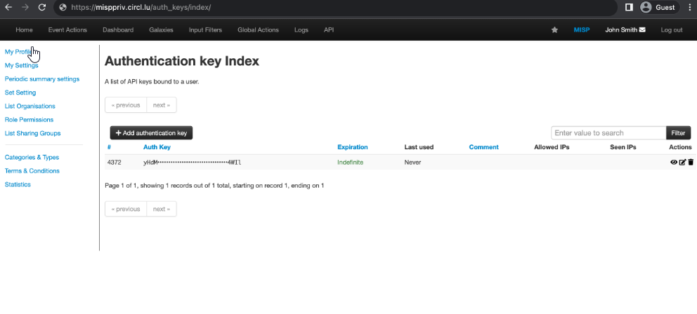

# STEPS 

1. **Access to the MISP instance** : Log in to the MISP instance.

2. **Navigate to your user profile** : If you don't find it navigate directly to the url /users/view/me.

3. **Add a new auth key** : Under Auth keys click on the + Add authentication key.

4. **Configure it** : Leave the Allowed IPs empty and mark the Read only checkbox.

5. **Copy it** : Once you get the key copy it and store it at somewhere safe place because you won't be able to see the whole key again !!!

7. **Apply it** : Now paste the key in Thehive server's /etc/thehive/application.conf file, shown in the TheHive Configuration guide.
