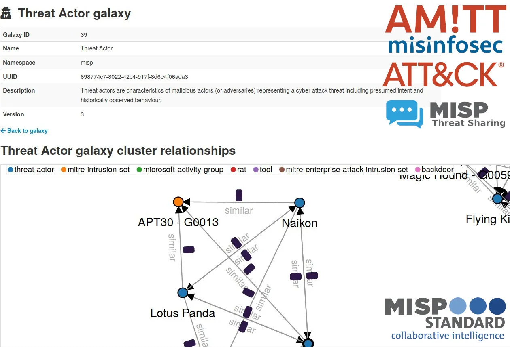
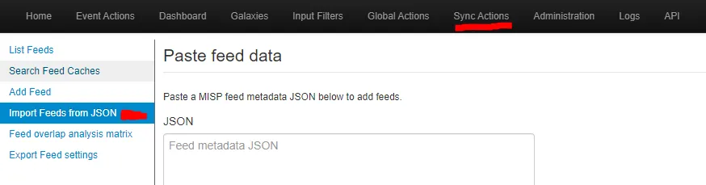
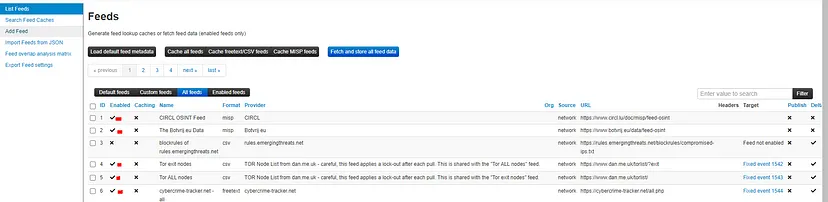
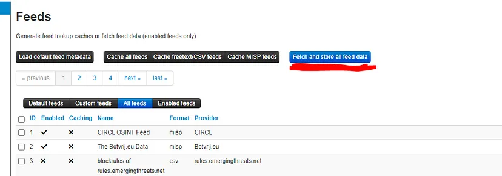
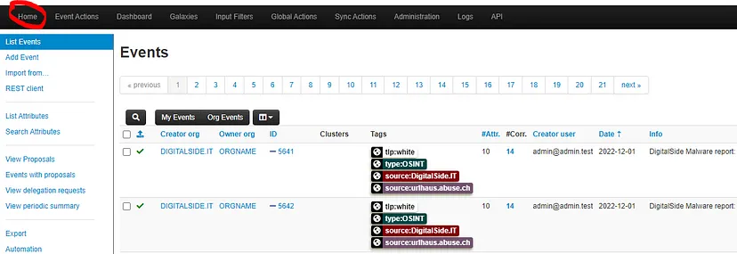
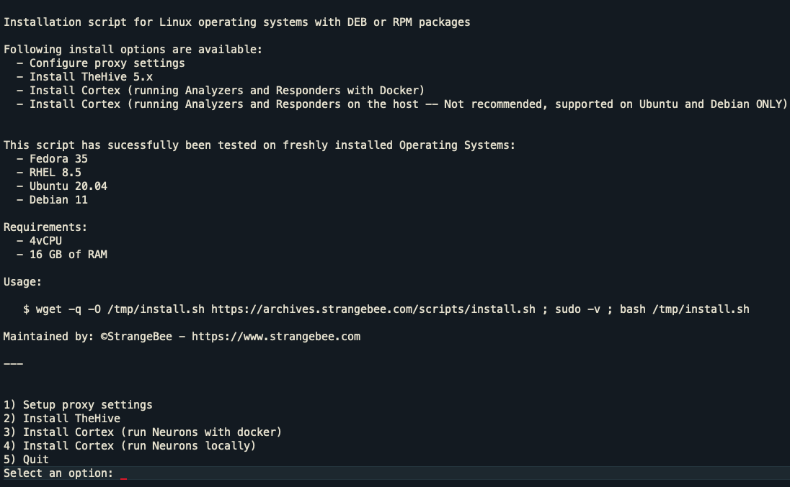
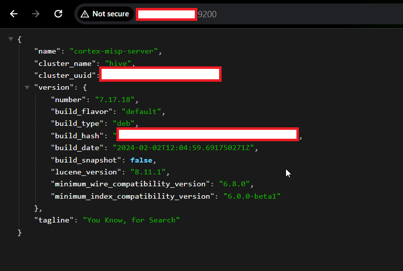

# Cortex and MISP configuration guide 

- Create a VM instance on AWS / GCE (any  other cloud computing platform) with allocation of static _IP address_ and specified hardware requirements.

- __*Very Important Note*__ (Your machine should allow SSH traffic on specified ports like 9001, 443, 80, 9200) OR else you can configure the machine such that it allows all traffic on all ports if you want to change the port configs.

- You can modify the traffic policies as per security requirement in your organization !!!
### Operating systems

 - Ubuntu 20.04 LTS
 - Debian 11
 - RHEL 8
 - Fedora 35

 Note: There is reason behind using these specific OS because we can get the whole system configuration automatically else we have to create all files.
 ---
 # **__MISP Installation and Configuration__**

## What is MISP?

MISP Threat Sharing is an open source threat intelligence platform. The project develops utilities and documentation for more effective threat intelligence, by sharing indicators of compromise

MISP allows not only to store, share, collaborate on cyber security indicators, malware analysis, but also to use the IoCs and information to detect and prevent attacks, frauds or threats against ICT infrastructures, organizations or people.

Some of the features included are:

- An efficient IoC and indicators database allowing to store technical and non-technical information about malware samples, incidents, attackers and intelligence.

- Automatic correlation finding relationships between attributes and indicators from malware, attacks campaigns or analysis.

- Flexible data model where complex objects can be expressed and linked together to express threat intelligence, incidents or connected elements.

- Built-in sharing functionality. MISP can synchronize automatically events and attributes among different MISP. Advanced filtering functionalities can be used to meet each organization sharing policy including a flexible sharing group capacity and an attribute level distribution mechanism.

- Intuitive user-interface for end-users to create, update and collaborate on events and attributes/indicators.

- Flexible free text import tool to ease the integration of unstructured reports into MISP.

- Flexible API to integrate MISP with your own solutions. MISP is bundled with PyMISP which is a flexible Python Library to fetch, add or update events attributes, handle malware samples or search for attributes.

- STIX support: export data in the STIX format (XML and JSON) including export/import in STIX 2.0 format.

--- 

# 

## Install Docker and Docker-compose 
Note: I have done the configuration for Ubuntu.

Run the following command to uninstall all conflicting packages:

```
$  sudo su # get the root privileges

$  apt-get update

$  for pkg in docker.io docker-doc docker-compose docker-compose-v2 podman-docker containerd runc; do sudo apt-get remove $pkg; done
```

---
STEPS :
---
1. Set up Docker's apt repository.
```
# Add Docker's official GPG key:
sudo apt-get update
sudo apt-get install ca-certificates curl
sudo install -m 0755 -d /etc/apt/keyrings
sudo curl -fsSL https://download.docker.com/linux/ubuntu/gpg -o /etc/apt/keyrings/docker.asc
sudo chmod a+r /etc/apt/keyrings/docker.asc

# Add the repository to Apt sources:
echo \
  "deb [arch=$(dpkg --print-architecture) signed-by=/etc/apt/keyrings/docker.asc] https://download.docker.com/linux/ubuntu \
  $(. /etc/os-release && echo "$VERSION_CODENAME") stable" | \
  sudo tee /etc/apt/sources.list.d/docker.list > /dev/null

sudo apt-get update
```

2. Install the Docker packages.
- To install the latest version, run:
```
$ sudo apt-get install docker-ce docker-ce-cli containerd.io docker-buildx-plugin docker-compose-plugin
```

3. Verify that the Docker Engine installation is successful by running the hello-world image.
```
 $  sudo docker run hello-world

 $ apt-get update
```

4. To download and install Compose standalone, run:
```
$  curl -SL https://github.com/docker/compose/releases/download/v2.24.6/docker-compose-linux-x86_64 -o /usr/local/bin/docker-compose
```

5. Apply executable permissions to the standalone binary in the target path for the installation.
```
$  chmod +x /usr/local/bin/docker-compose

OR 

$  chmod +x /usr/bin/docker-compose
```

6. Test the installation.
```
$ docker compose version

#output  : Docker Compose version vx.xx.x
```

7.  Fetch the MISP-Docker repo:
```
$ git clone https://github.com/MISP/misp-docker
$ cd misp-docker
```

8. Set Config 
```
$ cp template.env .env
$ nano .env
```

Clear all the content of .env file and paste the below code with and modify the the code as per your need.
```
MYSQL_HOST=db
MYSQL_DATABASE=misp
MYSQL_USER=misp
MYSQL_PASSWORD=misp
MYSQL_ROOT_PASSWORD=misp

MISP_ADMIN_EMAIL=admin@admin.test
MISP_ADMIN_PASSPHRASE=admin 
MISP_BASEURL=https://localhost

#replace the "localhost" with your machine public IP address
#example : my machine public IP address on which my misp server will be running is "34.25.16.125" then
# MISP_BASEURL=https://34.25.16.125

POSTFIX_RELAY_HOST=relay.fqdn

DATA_DIR=./data
```

##
(
Note : if you want to start docker MISP automatically then you have to set some parameters in docker-compose.yml.

your docker-compose.yml file should like this
)

```
version: '3'
services:
  # This is capable to relay via gmail, Amazon SES, or generic relays
  # See: https://hub.docker.com/r/ixdotai/smtp
  mail:
    image: ixdotai/smtp
    environment:
      - "SMARTHOST_ADDRESS=${SMARTHOST_ADDRESS}"
      - "SMARTHOST_PORT=${SMARTHOST_PORT}"
      - "SMARTHOST_USER=${SMARTHOST_USER}"
      - "SMARTHOST_PASSWORD=${SMARTHOST_PASSWORD}"
      - "SMARTHOST_ALIASES=${SMARTHOST_ALIASES}"

  redis:
    image: redis:7.2

  db:
    # We use MariaDB because it supports ARM and has the expected collations
    image: mariadb:10.11
    restart: always
    environment:
      - "MYSQL_USER=${MYSQL_USER:-misp}"
      - "MYSQL_PASSWORD=${MYSQL_PASSWORD:-example}"
      - "MYSQL_ROOT_PASSWORD=${MYSQL_ROOT_PASSWORD:-password}"
      - "MYSQL_DATABASE=${MYSQL_DATABASE:-misp}"
    volumes:
      - mysql_data:/var/lib/mysql
    cap_add:
      - SYS_NICE  # CAP_SYS_NICE Prevent runaway mysql log

  misp-core:
    image: ghcr.io/misp/misp-docker/misp-core:latest
    restart: always
    build:
      context: core/.
      args:
          - CORE_TAG=${CORE_TAG}
          - CORE_COMMIT=${CORE_COMMIT}
          - PHP_VER=${PHP_VER}
          - PYPI_REDIS_VERSION=${PYPI_REDIS_VERSION}
          - PYPI_LIEF_VERSION=${PYPI_LIEF_VERSION}
          - PYPI_PYDEEP2_VERSION=${PYPI_PYDEEP2_VERSION}
          - PYPI_PYTHON_MAGIC_VERSION=${PYPI_PYTHON_MAGIC_VERSION}
          - PYPI_MISP_LIB_STIX2_VERSION=${PYPI_MISP_LIB_STIX2_VERSION}
          - PYPI_MAEC_VERSION=${PYPI_MAEC_VERSION}
          - PYPI_MIXBOX_VERSION=${PYPI_MIXBOX_VERSION}
          - PYPI_CYBOX_VERSION=${PYPI_CYBOX_VERSION}
          - PYPI_PYMISP_VERSION=${PYPI_PYMISP_VERSION}
    depends_on:
      - redis
      - db
    ports:
      - "80:80"
      - "443:443"
    volumes:
      - "./configs/:/var/www/MISP/app/Config/"
      - "./logs/:/var/www/MISP/app/tmp/logs/"
      - "./files/:/var/www/MISP/app/files/"
      - "./ssl/:/etc/nginx/certs/"
      - "./gnupg/:/var/www/MISP/.gnupg/"
      # customize by replacing ${CUSTOM_PATH} with a path containing 'files/customize_misp.sh'
      # - "${CUSTOM_PATH}/:/custom/"
      # mount custom ca root certificates
      # - "./rootca.pem:/usr/local/share/ca-certificates/rootca.crt"
    environment:
      - "BASE_URL=${BASE_URL}"
      - "CRON_USER_ID=${CRON_USER_ID}"
      - "DISABLE_IPV6=${DISABLE_IPV6}"
      # standard settings
      - "ADMIN_EMAIL=${ADMIN_EMAIL}"
      - "ADMIN_PASSWORD=${ADMIN_PASSWORD}"
      - "ADMIN_KEY=${ADMIN_KEY}"
      - "ADMIN_ORG=${ADMIN_ORG}"
      - "GPG_PASSPHRASE=${GPG_PASSPHRASE}"
      # OIDC authentication settings
      - "OIDC_ENABLE=${OIDC_ENABLE}"
      - "OIDC_PROVIDER_URL=${OIDC_PROVIDER_URL}"
      - "OIDC_CLIENT_ID=${OIDC_CLIENT_ID}"
      - "OIDC_CLIENT_SECRET=${OIDC_CLIENT_SECRET}"
      - "OIDC_ROLES_PROPERTY=${OIDC_ROLES_PROPERTY}"
      - "OIDC_ROLES_MAPPING=${OIDC_ROLES_MAPPING}"
      - "OIDC_DEFAULT_ORG=${OIDC_DEFAULT_ORG}"
      # LDAP authentication settings
      - "LDAP_ENABLE=${LDAP_ENABLE}"
      - "LDAP_APACHE_ENV=${LDAP_APACHE_ENV}"
      - "LDAP_SERVER=${LDAP_SERVER}"
      - "LDAP_STARTTLS=${LDAP_STARTTLS}"
      - "LDAP_READER_USER=${LDAP_READER_USER}"
      - "LDAP_READER_PASSWORD=${LDAP_READER_PASSWORD}"
      - "LDAP_DN=${LDAP_DN}"
      - "LDAP_SEARCH_FILTER=${LDAP_SEARCH_FILTER}"
      - "LDAP_SEARCH_ATTRIBUTE=${LDAP_SEARCH_ATTRIBUTE}"
      - "LDAP_FILTER=${LDAP_FILTER}"
      - "LDAP_DEFAULT_ROLE_ID=${LDAP_DEFAULT_ROLE_ID}"
      - "LDAP_DEFAULT_ORG=${LDAP_DEFAULT_ORG}"
      - "LDAP_EMAIL_FIELD=${LDAP_EMAIL_FIELD}"
      - "LDAP_OPT_PROTOCOL_VERSION=${LDAP_OPT_PROTOCOL_VERSION}"
      - "LDAP_OPT_NETWORK_TIMEOUT=${LDAP_OPT_NETWORK_TIMEOUT}"
      - "LDAP_OPT_REFERRALS=${LDAP_OPT_REFERRALS}"
      # sync server settings (see https://www.misp-project.org/openapi/#tag/Servers for more options)
      - "SYNCSERVERS=${SYNCSERVERS}"
      - |
        SYNCSERVERS_1_DATA=
        {
          "remote_org_uuid": "${SYNCSERVERS_1_UUID}",
          "name": "${SYNCSERVERS_1_NAME}",
          "authkey": "${SYNCSERVERS_1_KEY}",
          "url": "${SYNCSERVERS_1_URL}",
          "pull": true
        }
      # mysql settings
      - "MYSQL_HOST=${MYSQL_HOST:-db}"
      - "MYSQL_PORT=${MYSQL_PORT:-3306}"
      - "MYSQL_USER=${MYSQL_USER:-misp}"
      - "MYSQL_PASSWORD=${MYSQL_PASSWORD:-example}"
      - "MYSQL_DATABASE=${MYSQL_DATABASE:-misp}"
  
  misp-modules:
    image: ghcr.io/misp/misp-docker/misp-modules:latest
    restart: always
    build:
      context: modules/.
      args:
        - MODULES_TAG=${MODULES_TAG}
        - MODULES_COMMIT=${MODULES_COMMIT}
        - LIBFAUP_COMMIT=${LIBFAUP_COMMIT}
    environment:
      - "REDIS_BACKEND=redis"
    depends_on:
      - redis

volumes:
    mysql_data:
```

### [Here I have set "restart" parameter to "always"]

##

9. Build the containers
```
docker-compose build
or
docker compose build
```

10. Make sure that docker images has created successfully
```
docker ps -a
```

11. Run containers
```
docker-compose up -d
or
docker compose up -d
```

12. Access MISP Dashboard by accessing URL that we have defined earlier. (https://34.25.16.125), accept the certificate alert and continue with unsafe mode

13. login into admin panel using default credentials 
    - username : admin@admin.test
    - password : admin

14. change your password and login into main page.

15. Add Feeds

__[JSON FEED FILE](../Cortex-MISP/defaults.json)__



16. Enable your Feeds



17. Fetch Feed Data



18. Explore Events



---
---
---
---


# **__Cortex Installation and Configuration__**


Note : Here I have created Cortex server with all configuration in one system in organization you can also configure in the distributed manner.

---
### __[Reference (Important !!!!!)](https://docs.strangebee.com/cortex/)__
---
# Cortex

Cortex solves two common problems frequently encountered by SOCs, CSIRTs and security researchers in the course of threat intelligence, digital forensics and incident response:

How to analyze observables they have collected, at scale, by querying a single tool instead of several?
How to actively respond to threats and interact with the constituency and other teams?

Thanks to its many analyzers and to its RESTful API, Cortex makes observable analysis a breeze, particularly if called from TheHive, the highly popular, Security Incident Response Platform (SIRP).

TheHive can also leverage Cortex responders to perform specific actions on alerts, cases, tasks and observables collected in the course of the investigation: send an email to the constituents, block an IP address at the proxy level, notify team members that an alert needs to be taken care of urgently and much more.

Many features are included with Cortex:

- Manage multiple organizations (i.e multi-tenancy)
Manage users per organizations and roles
Specify per-org analyzer & responder configuration
Define rate limits: avoid consuming all your quotas at once

- Cache: an analysis is not re-executed for the same observable if a given analyzer is called on that observable several times within a specific timespan (10 minutes by default, can be adjusted for each analyzer).

---
# STEPS

1. use all-in-one installation script:
    - Note : only for above mentioned OS 
```
$  wget -q -O /tmp/install.sh https://archives.strangebee.com/scripts/install.sh ; sudo -v ; bash /tmp/install.sh
```



#### specifically choose "choose option 3" !!!

2. Edit the Elasticsearch Configurations

```
$  nano /etc/elasticsearch/elasticsearch.yml
```

3. Modify the file as given below.
```
http.host: 0.0.0.0
transport.host: 127.0.0.1
cluster.name: hive
thread_pool.search.queue_size: 100000
path.logs: "/var/log/elasticsearch"
path.data: "/var/lib/elasticsearch"
xpack.security.enabled: false
script.allowed_types: "inline,stored"
```

4. Restart the elasticsearch service and check the status of cortex and elasticsearch services
```
$  systemctl restart elasticsearch
$  systemctl status elasticsearch #{active(running)}
$  systemctl status cortex #{actice(running)}

#enable the processes
$  systemctl enable elasticsearch
$  systemctl enable cortex
```

5. Check that on which port elasticsearch and cortex are running( By default they are running on 9200 and 9001).

access,
https://<MACHINE_IP_ADDRESS>:9200 you will get the output similar to the following,



6. access,
https://<MACHINE_IP_ADDRESS>:9001 then you have to update the database and create the admin credentials and then log into the the admin panel.
