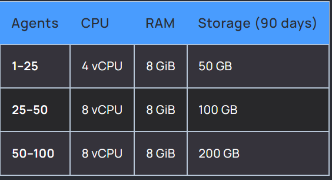
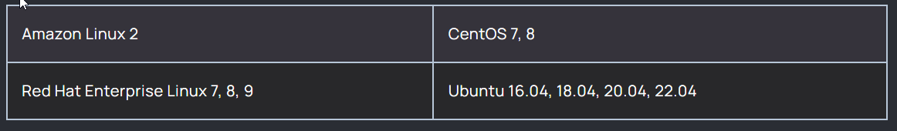
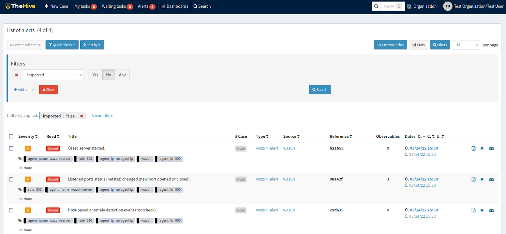

# **__Wazuh Server Installation and Configuration(Wazuh 4.7)__**

Wazuh is a security platform that provides unified XDR and SIEM protection for endpoints and cloud workloads. The solution is composed of a single universal agent and three central components: the Wazuh server, the Wazuh indexer, and the Wazuh dashboard.


Wazuh is free and open source. Its components abide by the [GNU General Public License, version 2](https://www.gnu.org/licenses/old-licenses/gpl-2.0.en.html), and the [Apache License, Version 2.0 (ALv2)](https://www.apache.org/licenses/LICENSE-2.0).

## **__[REFERENCE (Important !!!)](https://documentation.wazuh.com/current/quickstart.html)__**

#### - Create a VM instance on AWS / GCE (any  other cloud computing platform) with allocation of static _IP address_ and specified hardware requirements.

#### - __*Very Important Note*__ (Your machine should allow SSH traffic on specified ports) OR else you can configure the machine such that it allows all traffic on all ports if you want to change the port configs.

- You can modify the traffic policies as per security requirement in your organization !!!

# Requirements

### **Hardware**

Hardware requirements highly depend on the number of protected endpoints and cloud workloads. This number can help estimate how much data will be analyzed and how many security alerts will be stored and indexed.


For larger environments we recommend a distributed deployment. Multi-node cluster configuration is available for the Wazuh server and for the Wazuh indexer, providing high availability and load balancing.



### **Operating system**

Wazuh central components can be installed on a 64-bit Linux operating system. Wazuh recommends any of the following operating system versions:



### **Browser compatibility**

Wazuh dashboard supports the following web browsers:

- Chrome 95 or later

- Firefox 93 or later

- Safari 13.7 or later

- Other Chromium-based browsers might also work. Internet Explorer 11 is not supported.


# **__INSTALLATION AND CONFIGURATION__**

#STEPS

#### 1. Download and run the Wazuh installation assistant.
```
$  curl -sO https://packages.wazuh.com/4.7/wazuh-install.sh && sudo bash ./wazuh-install.sh -a
```

###### Once the assistant finishes the installation, the output shows the access credentials and a message that confirms that the installation was successful.
```
INFO: --- Summary ---
INFO: You can access the web interface https://<wazuh-dashboard-ip>
    User: admin
    Password: <ADMIN_PASSWORD>
INFO: Installation finished.
```
###### You now have installed and configured Wazuh.

#### 2. Access the Wazuh web interface with https://<wazuh-dashboard-ip> and your credentials:(PUBLIC IP ADDRESS)

- Username: admin

- Password: <ADMIN_PASSWORD>


###### When you access the Wazuh dashboard for the first time, the browser shows a warning message stating that the certificate was not issued by a trusted authority. This is expected and the user has the option to accept the certificate as an exception or, alternatively, configure the system to use a certificate from a trusted authority.

###### If you want to uninstall the Wazuh central components, run the Wazuh installation assistant using the option -u or –-uninstall.


#### 3. install TheHive Python module:
```
$  sudo /var/ossec/framework/python/bin/pip3 install thehive4py==1.8.1
```

#### 4. create the custom integration script by pasting the following python code in /var/ossec/integrations/custom-w2thive.py. The lvl_threshold variable in the script indicates the minimum alert level that will be forwarded to TheHive. The variable can be customized so that only relevant alerts are forwarded to TheHive:

#### [custom-w2thive.py](./custom-w2thive.py)

#### 5. We create a bash script as /var/ossec/integrations/custom-w2thive. This will properly execute the .py script created in the previous step:

#### [custom-w2thive](./custom-w2thive)

#### 6. We change the files’ permission and the ownership to ensure that Wazuh has adequate permissions to access and run them:
- Note : change the user and group according to your system
```
sudo chmod 755 /var/ossec/integrations/custom-w2thive.py
sudo chmod 755 /var/ossec/integrations/custom-w2thive
sudo chown root:ossec /var/ossec/integrations/custom-w2thive.py #change user and group
sudo chown root:ossec /var/ossec/integrations/custom-w2thive    #change user and group
```

#### 7. To allow Wazuh to run the integration script, we add the following lines to the manager configuration file located at /var/ossec/etc/ossec.conf. We insert the IP address for TheHive server along with the API key that was generated earlier:
```
<ossec_config>
…
  <integration>
    <name>custom-w2thive</name>
    <hook_url>http://TheHive_Server_IP:9000</hook_url>
    <api_key>RWw/Ii0yE6l+Nnd3nv3o3Uz+5UuHQYTM</api_key>
    <alert_format>json</alert_format>
  </integration>
…
</ossec_config>
```

#### 8. Restart the manager to apply the changes:
```
sudo systemctl restart wazuh-manager
```

#### 9. Log into TheHive with our test user account, and we can see Wazuh generated alerts under the “Alerts” tab:



## At this point, we can proceed to perform other standard TheHive actions on the alerts, such as creating cases on them or adding them to other existing cases.
