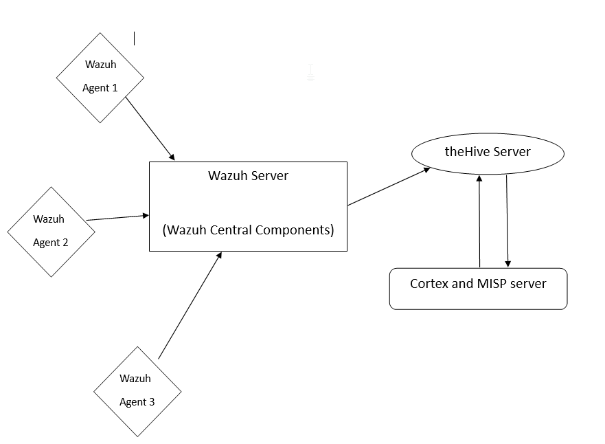

# Basic flow of the configuration

## **Architecture**

# Configuration Steps 
###  1.  Create the "Cortex and MISP server"(using docker-compose)
###  2.  Create the "theHive Server"
###  3.  Create the "Wazuh Server"
###  4.  Install "Wazuh Agents"

---

# **_STEP-1_** : Cortex and MISP Server
- Hardware requirements for the server
    - 4vCPU
    - 16 GB RAM 

- [Step by Step installation guide](./Cortex-MISP/configuration.md)

# **_STEP-2_** : theHive Server
- Hardware requirements for the server
    - 4vCPU
    - 16 GB RAM 

- [Step by Step installation guide](./theHive/configuration.md)

# **_STEP-3_** : Wazuh Server
- [Step by Step installation guide](./Wazuh/Wazuh-server.md)

# **_STEP-4_** : Wazuh Agents
- [Step by Step installation guide](./Wazuh/Wazuh-agent.md)

