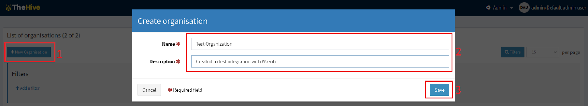
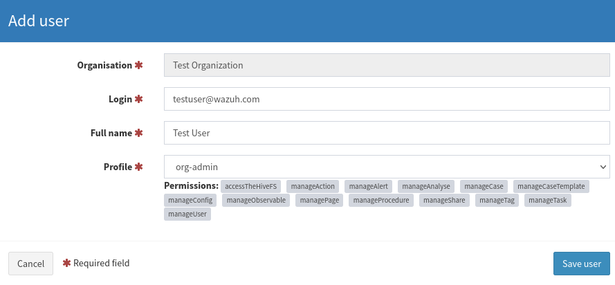
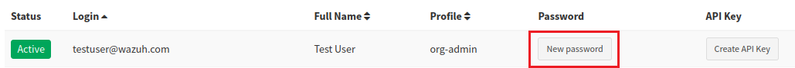
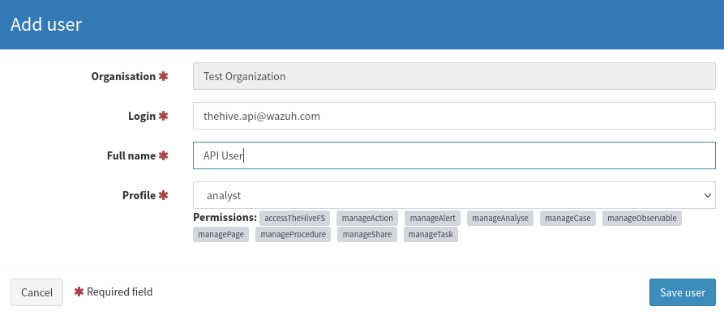
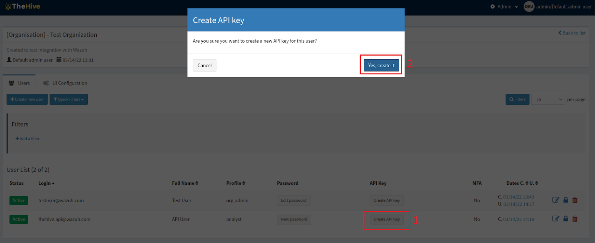
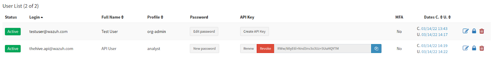

# **__Prepare TheHive__**

#### 1. We create a new organization on TheHive web interface and with an administrator account.
    

#### 2. In Test Organization, we create a new user with organization administrator privileges.

#### 3. This user has permissions to manage the organization, including creating new users, managing cases, and alerts, amongst others. We also create a password for this user so that we can log in to view the dashboard and manage cases. This is done by clicking on “New password” beside the user account and entering the desired password.

#### 4. The integration with Wazuh is possible with the aid of TheHive REST API. Therefore, we need a user on TheHive that can create alerts via the API. We create an account with an “analyst” privilege for this purpose.

#### 5. For the next step, we generate the API key for the user:

#### 6. In order to extract the API key, we reveal the key to view and copy it out for future use:

