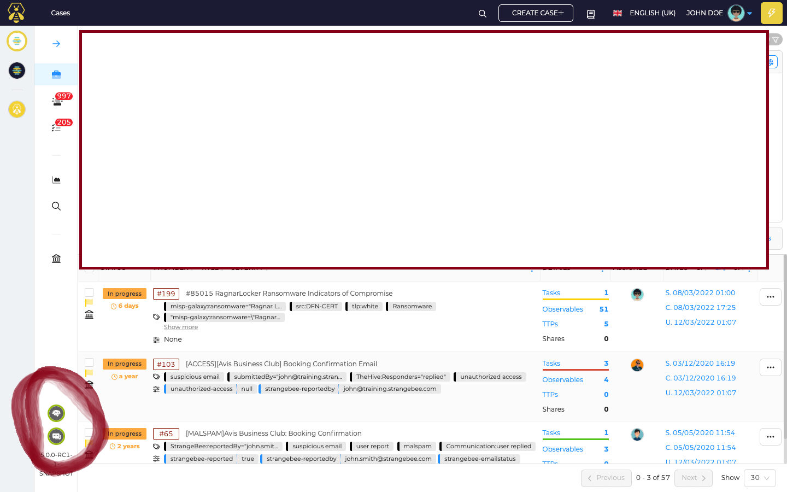

# TheHive(5) configuration guide 

- Create a VM instance on AWS / GCE (any  other cloud computing platform) with allocation of static _IP address_ and specified hardware requirements.

- __*Very Important Note*__ (Your machine should allow SSH traffic on specified ports like 9000, 9200) OR else you can configure the machine such that it allows all traffic on all ports if you want to change the port configs.

- You can modify the traffic policies as per security requirement in your organization !!!

 
# **__TheHive Installation and Configuration__**

TheHive is a scalable, open source, and free security incident response platform designed to make life easier for SOCs, CSIRTs, CERTs, and any information security practitioner dealing with security incidents that need to be investigated and acted upon swiftly.

TheHive has REST APIs that make it possible to integrate with various security solutions in order to collect security events and alerts for further investigation and case tracking. In this article, we show how Wazuh is integrated with TheHive.

### __[Reference (Important !!!!!)](https://docs.strangebee.com/thehive/setup/)__

---

Note : Here we can configure TheHive in two ways 
1. Install All-in-one Installation
2. Step by Step Installation 

---

#  **__METHOD : 1 All-in-One Installation__**


### Operating systems

 - Ubuntu 20.04 LTS
 - Debian 11
 - RHEL 8
 - Fedora 35

 Note: TheHive All in one configuration only supports the listed OS only so if you opt the 1st option then please be specific with your OS system !!!
 

 ### __[Reference All-in-one-Architecture](https://docs.strangebee.com/thehive/setup/#installation-guides)__

 ---


#  **__METHOD : 2 Step-by-Step Installation__**
Note : I have used this 2nd method to install TheHive server, please stick to this configuration else you have to do all the steps again !!!

### __**VERY IMPORTANT : HERE I HAVE USED DEBIAN BASED "OS"  IF YOU ARE ON OTHER "OS" THEN PLEASE REFER THE LINK GIVEN BELOW**__

## __[Reference Step-by-Step](https://docs.strangebee.com/thehive/setup/installation/step-by-step-guide/)__

# STEPS

---
1. This process requires few programs b eing already installed on the system. 
```
$  apt install wget gnupg apt-transport-https git ca-certificates ca-certificates-java curl  software-properties-common python3-pip lsb_release

```

---
## Note : 
- apt install wget gnupg apt-transport-https git ca-certificates ca-certificates-java curl  software-properties-common python3-pip lsb_release
- Java version 8 is no longer supported
---

2. Install Java Virtual Machine
```
$  wget -qO- https://apt.corretto.aws/corretto.key | sudo gpg --dearmor  -o /usr/share/keyrings/corretto.gpg

$  echo "deb [signed-by=/usr/share/keyrings/corretto.gpg] https://apt.corretto.aws stable main" |  sudo tee -a /etc/apt/sources.list.d/corretto.sources.list

$  sudo apt update

$  sudo apt install java-common java-11-amazon-corretto-jdk

$  echo JAVA_HOME="/usr/lib/jvm/java-11-amazon-corretto" | sudo tee -a /etc/environment 

$  export JAVA_HOME="/usr/lib/jvm/java-11-amazon-corretto"
```

3. Install Apache Cassandra
- Apache Cassandra is a scalable and high available database. TheHive supports the latest stable version 4.0.x of Cassandra.
```
$  wget -qO -  https://downloads.apache.org/cassandra/KEYS | sudo gpg --dearmor  -o /usr/share/keyrings/cassandra-archive.gpg

$  echo "deb [signed-by=/usr/share/keyrings/cassandra-archive.gpg] https://debian.cassandra.apache.org 40x main" |  sudo tee -a /etc/apt/sources.list.d/cassandra.sources.list 

$  sudo apt update

$  sudo apt install cassandra
```

---
### Note : By default, data is stored in /var/lib/cassandra
---

4. Configure Cassandra : Cassandra service will start automatically so you have to first stop it and do some changes in the configuration then after you have to restart the service(process) again.
```
$  sudo systemctl stop cassandra
$  sudo rm -rf /var/lib/cassandra/data/system/*
$  sudo nano /etc/cassandra/cassandra.yaml
```

now, do the following changes in the configuration of cassandra
```
# content from /etc/cassandra/cassandra.yaml
[..]
cluster_name: 'thp'
data_file_directories:
- '/var/lib/cassandra/data'
commitlog_directory: '/var/lib/cassandra/commitlog'
saved_caches_directory: '/var/lib/cassandra/saved_caches'
hints_directory: 
- '/var/lib/cassandra/hints'
[..]
```
### !!!Verify that your file also has set these parameters!!! ###


5. Start the Cassandra service and check the status of service.
```
$  sudo systemctl start cassandra
$  sudo systemctl status cassandra
```

### Note : By default Cassandra listens on 7000/tcp (inter-node), 9042/tcp (client).


6. Install Elasticsearch
- TheHive requires Elasticsearch to manage data indices.(Elasticsearch 7.x only is supported)
```
$  wget -qO - https://artifacts.elastic.co/GPG-KEY-elasticsearch |  sudo gpg --dearmor -o /usr/share/keyrings/elasticsearch-keyring.gpg

$  sudo apt-get install apt-transport-https

$  echo "deb [signed-by=/usr/share/keyrings/elasticsearch-keyring.gpg] https://artifacts.elastic.co/packages/7.x/apt stable main" |  sudo tee /etc/apt/sources.list.d/elastic-7.x.list 

$  sudo apt update

$  sudo apt install elasticsearch

$ sudo nano /etc/elasticsearch/elasticsearch.yml
```

---

7. Do configuration in Elasticsearch
- /etc/elasticsearch/elasticsearch.yml
- Elasticsearch configuration should contain the following lines:
```
http.host: 0.0.0.0
transport.host: 127.0.0.1
cluster.name: hive
thread_pool.search.queue_size: 100000
path.logs: "/var/log/elasticsearch"
path.data: "/var/lib/elasticsearch"
xpack.security.enabled: false
script.allowed_types: "inline,stored"
```

```
$ sudo nano /etc/elasticsearch/jvm.options
```
- Custom JVM options add the file /etc/elasticsearch/jvm.options.d/jvm.options with following lines:
- (This can be updated according the amount of memory available [half of memory available])
```
-Dlog4j2.formatMsgNoLookups=true
-Xms4g
-Xmx4g
```

---

8. Start the Elasticsearch service
```
$  sudo systemctl start elasticsearch
$  sudo systemctl enable elasticsearch
```

---

9. Configure the File Storage
For standalone production and test servers, we recommends using local filesystem. If you think about building a cluster with TheHive, you have several possible solutions: using NFS or S3 services; see the related guide for more details and an example with MinIO servers.

### Note :  [Fore S3 with Min.io](https://docs.strangebee.com/thehive/setup/installation/3-node-cluster/)

To store files on the local filesystem, start by choosing the dedicated folder (by default /opt/thp/thehive/files):
```
sudo mkdir -p /opt/thp/thehive/files
```

This path will be used in the configuration of TheHive.

Later, after having installed TheHive, ensure the user thehive owns the path chosen for storing files:
```
chown -R thehive:thehive /opt/thp/thehive/files #change as per your user and group exist on your system
```

---

10. Install TheHive
All packages are published on our packages repository. We support Debian and RPM packages as well as binary packages (zip archive). All packages are signed using our GPG key 562CBC1C. Its fingerprint is 0CD5 AC59 DE5C 5A8E 0EE1 3849 3D99 BB18 562C BC1C
```
$  wget -O- https://archives.strangebee.com/keys/strangebee.gpg | sudo gpg --dearmor -o /usr/share/keyrings/strangebee-archive-keyring.gpg

$ echo 'deb [signed-by=/usr/share/keyrings/strangebee-archive-keyring.gpg] https://deb.strangebee.com thehive-5.2 main' | sudo tee -a /etc/apt/sources.list.d/strangebee.list


$  sudo apt-get update

$  sudo apt-get install -y thehive
```

---

11. Configure TheHive
The configuration that comes with binary packages is ready for a standalone installation, everything on the same server.

In this context, and at this stage, you might need to set the following parameters accordingly:
```
[..]
# Service configuration
application.baseUrl = "http://localhost:9000" #Replace "localhost" with your system server public Ip address
play.http.context = "/"                       # 
[..]
```

---

12. Cortex & MISP Integration
By default the configuration file coming with packages contains following lines, enabling Cortex and MISP modules. If you are not using one them, you can comment the related line and restart the service.

Your application.conf file should like following.(/etc/thehive/application.conf)
```
# TheHive configuration - application.conf
#
#
# This is the default configuration file.
# This is prepared to run with all services locally:
# - Cassandra for the database
# - Elasticsearch for index engine
# - File storage is local in /opt/thp/thehive/files
#
# If this is not your setup, please refer to the documentation at:
# https://docs.strangebee.com/thehive/
#
#
# Secret key - used by Play Framework
# If TheHive is installed with DEB/RPM package, this is automatically generated
# If TheHive is not installed from DEB or RPM packages run the following
# command before starting thehive:
#   cat > /etc/thehive/secret.conf << _EOF_
#   play.http.secret.key="$(cat /dev/urandom | tr -dc 'a-zA-Z0-9' | fold -w 64 |#   head -n 1)"
#   _EOF_
include "/etc/thehive/secret.conf"


# Database and index configuration
# By default, TheHive is configured to connect to local Cassandra 4.x and a
# local Elasticsearch services without authentication.
db.janusgraph {
  storage {
    backend = cql
    hostname = ["127.0.0.1"]
    # Cassandra authentication (if configured)
    # username = "thehive"
    # password = "password"
    cql {
      cluster-name = thp
      keyspace = thehive
    }
  }
  index.search {
    backend = elasticsearch
    hostname = ["127.0.0.1"]
    index-name = thehive
  }
}

# Attachment storage configuration
# By default, TheHive is configured to store files locally in the folder.
# The path can be updated and should belong to the user/group running thehive service. (by default: thehive:th>
storage {
  provider = localfs
  localfs.location = /opt/thp/thehive/files
}

# Define the maximum size for an attachment accepted by TheHive
play.http.parser.maxDiskBuffer = 1GB
# Define maximum size of http request (except attachment)
play.http.parser.maxMemoryBuffer = 10M

# Service configuration
application.baseUrl = "http://xxx.xxx.xxx.xxx:9000" #Replace it with your TheHive server IP address
play.http.context = "/"

# Additional modules
#
# TheHive is strongly integrated with Cortex and MISP.
# Both modules are enabled by default. If not used, each one can be disabled by                                   
# commenting the configuration line.
scalligraph.modules += org.thp.thehive.connector.cortex.CortexModule
cortex {
  servers: [
    {
      name = "cortex-server"
      url = "https://xxx.xxx.xxx.xxx:9001" #Replace it with your Cortex server IP address
      auth {
        type = key
        key = "XXXXXXXXXXXXXXXXXXXXXXXXXXXXXXXXXXXX" #Enter your Cortex server API -key which you have generated previously
      }
      wsConfig {}
    }
  ]
}
scalligraph.modules += org.thp.thehive.connector.misp.MispModule
misp {
  interval: 1 hour
  servers: [
    {
      name = "MISP server"
      url = "https://xxx.xxx.xxx.xxx"  #Replace it with your MISP server IP address
      auth {
        type = key
        key = "XXXXXXXXXXXXXXXXXXXXXXXXXXXXXXXXXXXXXXXXXX" # Enter your MISP server authentication key which you have generated previously
      }
      tags = ["tag1", "tag2", "tag3"]
      caseTemplate = "misp"
      includedTheHiveOrganisations = ["Forenzy"]
    }
  ]
}

```

---

13. Run TheHive 
```
$  sudo systemctl start thehive

$  sudo systemctl enable thehive

$  sudo systemctl status thehive
```

Once it has started, open your browser and connect to http://YOUR_SERVER_ADDRESS:9000/.

The default admin user is admin@thehive.local with password secret. It is recommended to change the default password.


## **__NOTE : AFTER INTEGRATION YOUR HIVE DASHBOARD SHOULD LOOK THE GIVEN IMAGE WHERE THE MISP AND CORTEX ICONS SHOULD HAVE GREEN RING__**


