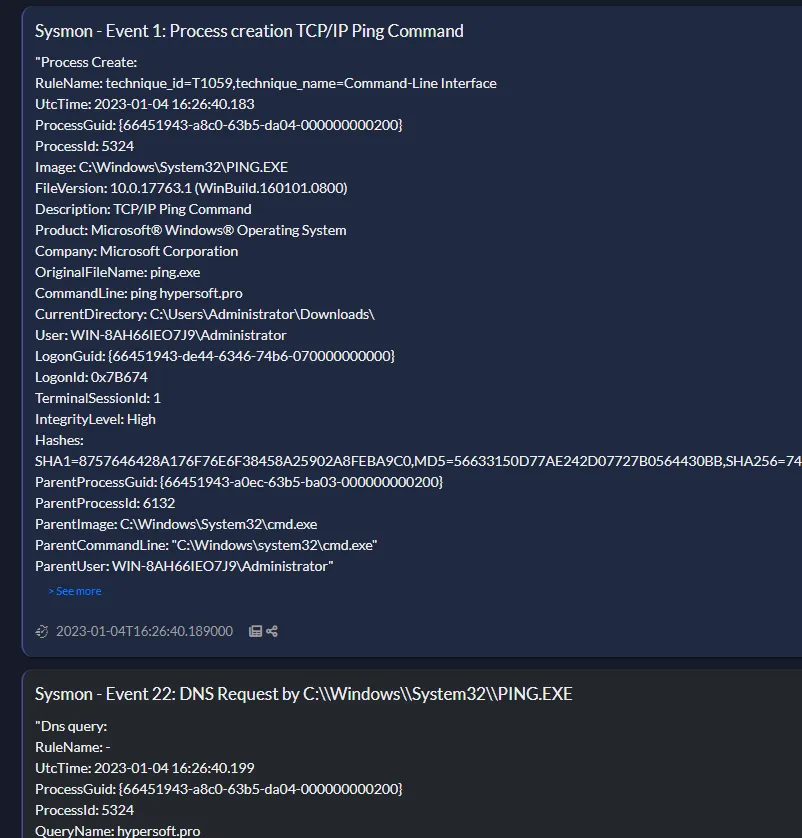
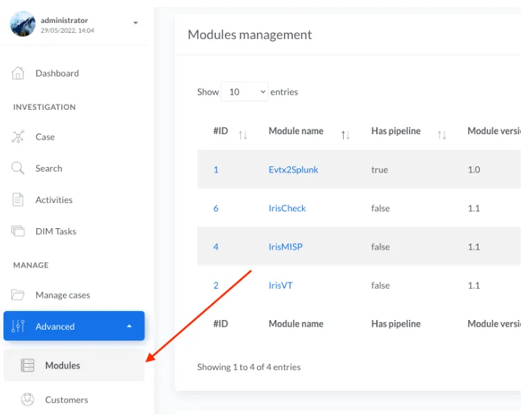

# **__DFIR-IRIS Configuration__**

## **Intro**

#### Incident Response Platforms (IRPs) are an essential tool for organizations of all sizes and industries, as they provide a centralized platform for managing incident response activities and help organizations respond quickly and effectively to cyber incidents. By using IRPs, organizations can reduce the impact of cyber incidents, minimize the risk of data breaches, and ensure compliance with industry regulations.

#### Incident Response Platforms (IRPs) are the second most crucial component of any Security Information and Event Management (SIEM) stack, following the ingestion of logs.

#### They provide a centralized platform for managing incident response activities, including threat detection, incident triage, incident investigation, and incident resolution.

* Incident triage
* Incident investigation
* Incident investigation
* Compliance and reporting

#### Prior to a change in their licensing, TheHIVE was the premier open-source solution for our incident response needs. Unfortunately, the modification to the license at the end of 2022 resulted in a significant reduction of the features available in the free version of the platform.

#### While SOC teams scrambled to find a competent replacement, DFIR-IRIS remained at the ready, eagerly awaiting its chance to demonstrate its capabilities.

#### IRIS checks off all the boxes when it comes to what features any Incident Response Platform must contain.

## **__Features of DFIR-IRIS__**

#### __Incident management__ : DFIR-IRIS allows incident responders to create, track, and manage incidents, including incident triage, investigation, and resolution.

#### __Evidence management__ : DFIR-IRIS allows incident responders to collect, preserve, and analyze digital evidence, including system images, network traffic, and log files.

#### __Reporting__ : DFIR-IRIS provides a range of reporting and documentation capabilities, including incident reports, case summaries, and timelines.

#### __Integration__ : DFIR-IRIS allows for the integration with various other tools, such as malware analysis tools, network traffic analysis tools, and forensic tools.

#### __Collaboration__ : DFIR-IRIS allows incident responders to collaborate and share information with other teams, such as incident response teams, forensic teams, and law enforcement agencies.


---

## **__Automate Anything With Modules__**

### the extended modules are the most compelling feature of IRIS. Modules are very similar to what TheHIVE achieves with Cortex’s Analyzers and Responders. IRIS modules are split into two types:

#### Pipeline modules : Allow upload and process of evidences through modular pipelines (eg: EVTX parsing and injection into a database or data visualizer)

#### Processor modules : Allow processing of IRIS data upon predefined actions / hooks. (eg: be notified when a new IOC is created and get VT/MISP insights for it).


---

# *_Installation_*

## Install Docker and Docker-compose 

#### Note: I have done the configuration for Debian.

#### Run the following command to uninstall all conflicting packages:

```
$  sudo su # get the root privileges

$  apt-get update

$  for pkg in docker.io docker-doc docker-compose docker-compose-v2 podman-docker containerd runc; do sudo apt-get remove $pkg; done
```

---
### STEPS :
---

#### 1. Set up Docker's apt repository.
```
# Add Docker's official GPG key:
sudo apt-get update
sudo apt-get install ca-certificates curl
sudo install -m 0755 -d /etc/apt/keyrings
sudo curl -fsSL https://download.docker.com/linux/ubuntu/gpg -o /etc/apt/keyrings/docker.asc
sudo chmod a+r /etc/apt/keyrings/docker.asc

# Add the repository to Apt sources:
echo \
  "deb [arch=$(dpkg --print-architecture) signed-by=/etc/apt/keyrings/docker.asc] https://download.docker.com/linux/ubuntu \
  $(. /etc/os-release && echo "$VERSION_CODENAME") stable" | \
  sudo tee /etc/apt/sources.list.d/docker.list > /dev/null

sudo apt-get update
```

#### 2. Install the Docker packages.
* To install the latest version, run:
```
$ sudo apt-get install docker-ce docker-ce-cli containerd.io docker-buildx-plugin docker-compose-plugin
```

#### 3. Verify that the Docker Engine installation is successful by running the hello-world image.
```
 $  sudo docker run hello-world

 $ apt-get update
```

#### 4. To download and install Compose standalone, run:
```
$  curl -SL https://github.com/docker/compose/releases/download/v2.24.6/docker-compose-linux-x86_64 -o /usr/local/bin/docker-compose
```

#### 5. Apply executable permissions to the standalone binary in the target path for the installation.
```
$  chmod +x /usr/local/bin/docker-compose

OR 

$  chmod +x /usr/bin/docker-compose
```

#### 6. Test the installation.
```
$ docker compose version

#output  : Docker Compose version vx.xx.x
```
---

## Install DFIR-IRIS

#### To ease the installation and upgrades, Iris is shipped in Docker containers. Thanks to Docker compose, it can be ready in a few minutes.
```
#  Clone the iris-web repository
git clone https://github.com/dfir-iris/iris-web.git
cd iris-web

# Checkout to the last tagged version 
git checkout v2.3.7

# Copy the environment file 
cp .env.model .env

# Build the dockers
docker compose build

# Run IRIS 
docker compose up
```

#### Note : you will be able to get the administrator login credentials by seeing the logs of iris-app, if you are not able to get them then just follow the blog and __**FOLLOW THE VIDEO FOR ACCESSING YOUR LOGIN CREDENTIALS AND A SHOWCASE OF THE PLATFORM**__

#### **[BLOG LINK (reference)](https://socfortress.medium.com/your-open-source-incident-response-platform-e9d839f02454)**

#### **[VIDEO LINK](https://youtu.be/XXyIv_aes4w)**


