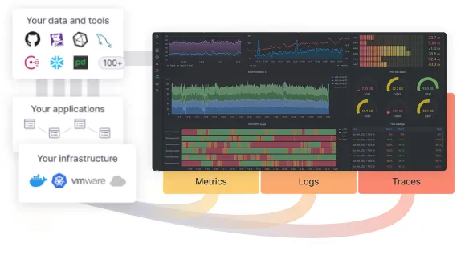
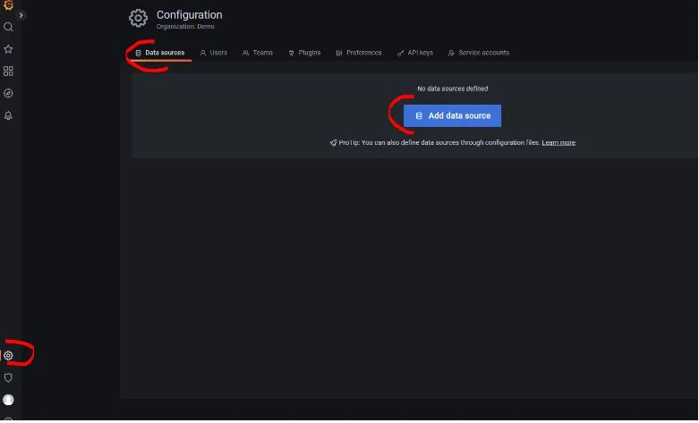
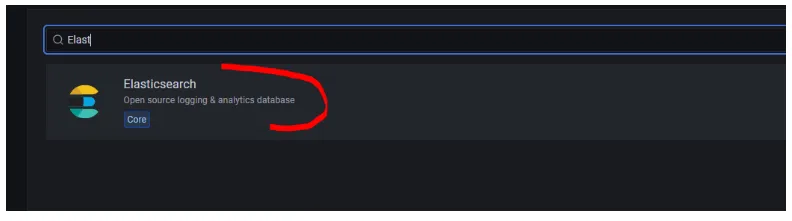
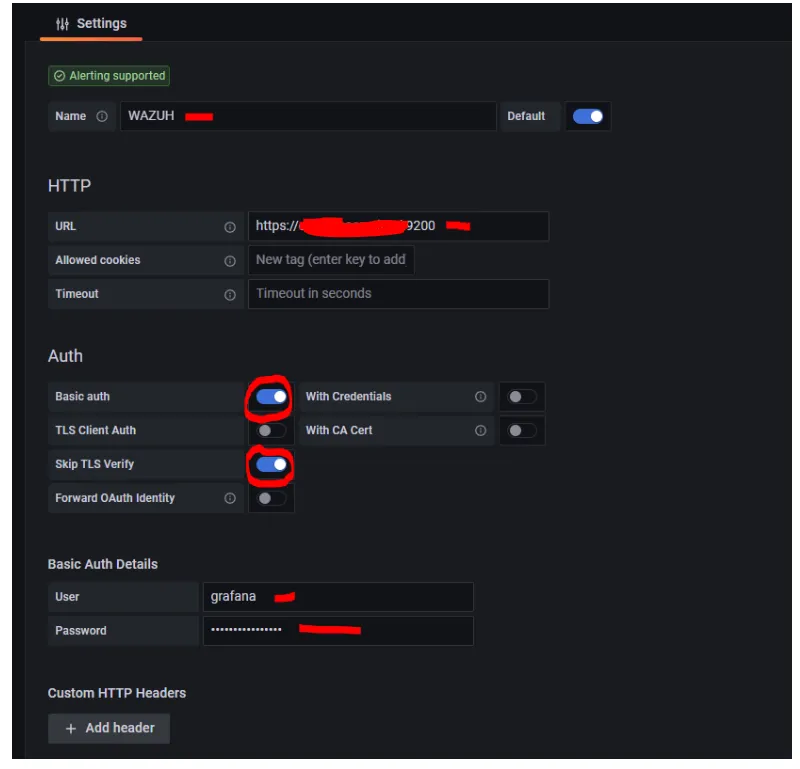
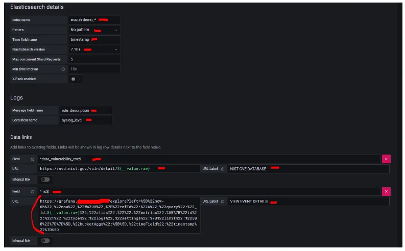
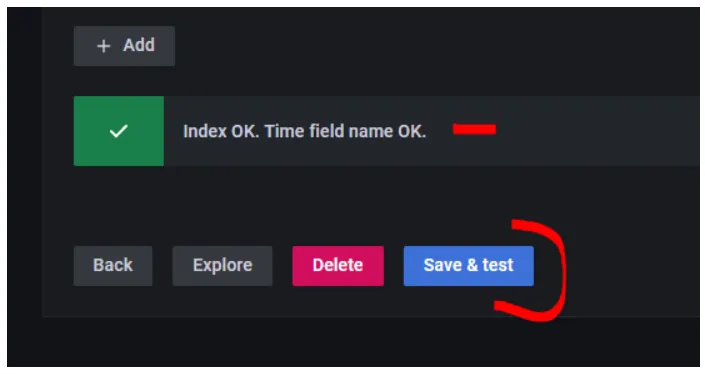
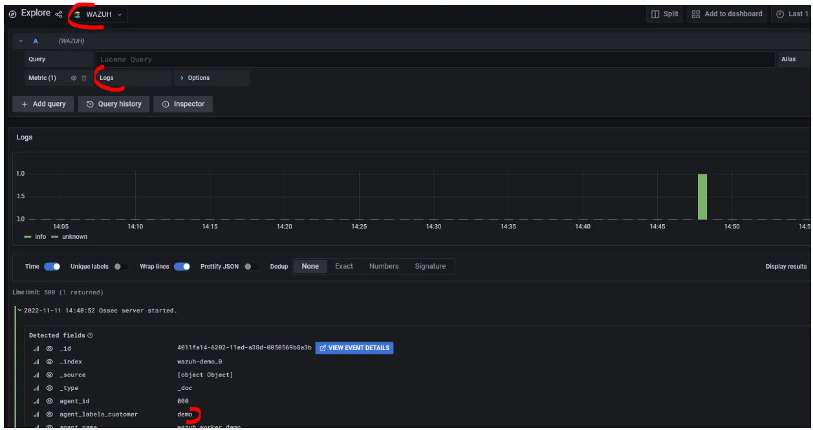
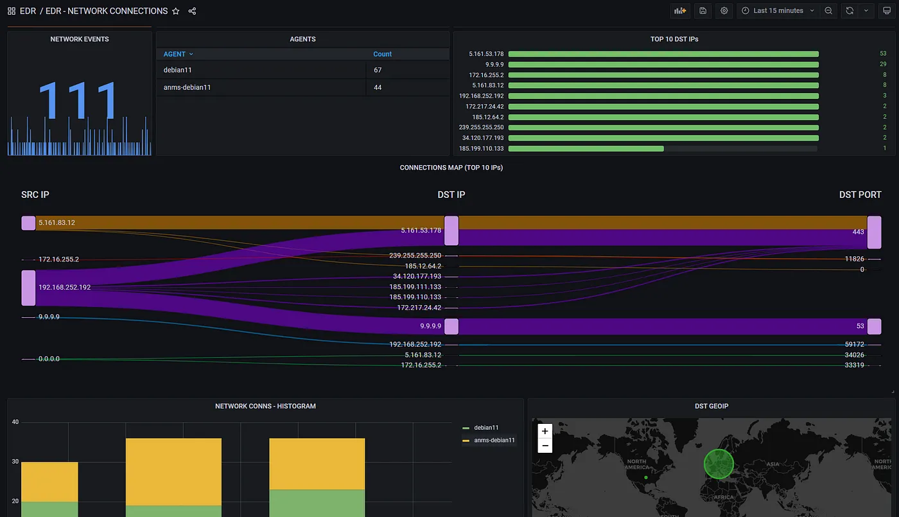

# Grafana configuration guide 

- Grafana is the perfect visualization tool when it comes to visualizing our security events. Kibana (Wazuh-Dashboards) can also be used to visualize our data, but over the years I have not been impressed with Kibana’s visualizations, difficulty to customize, lack of unique data sources, and overall speed. In my opinion, Grafana is the best visualization tool for all SIEM stacks.



## Grafana Visualization Panels

- Visualization panels are the building blocks that make up our dashboards. Dashboards are simply a combination of visualization panels pieced together to form a concise and accurate representation of the intent of the dashboard. Grafana’s wide range of visualization panels provides more flexibility and ease of “understanding the big picture” than is offered in Kibana.

- The Grafana community is strong and the ability to import prebuilt dashboards built by others in a matter of seconds allows us to start visualizing our data in no time!

- Customization is limitless with Grafana’s provided ability for us to write our own HTML and CSS panels. Grafana makes it simple for us to add our own branding and unique feel to our dashboards!

## Grafana Unique Data Sources

- Often times, the data that we want to display within our dashboards does not reside in just one datasource. I could have my SIEM logs being written to Elasticsearch, a MySQL database storing my threat intel, and a CSV file storing CNs and their associated DCs. Rather than trying to funnel that data into Elasticsearch, we can configure multiple data sources within Grafana with ease!

- __*Very Important Note*__ (Your machine should allow SSH traffic on specified ports like 3000, 3500) OR else you can configure the machine such that it allows all traffic on all ports if you want to change the port configs.

- You can modify the traffic policies as per security requirement in your organization !!!

### __[Reference (Important !!!!!)](https://github.com/grafana/grafana?pg=oss-graf&plcmt=hero-btn-3)__

### __[Installation Documentation](https://grafana.com/docs/grafana/latest/setup-grafana/installation/)__

 ---


#  **__Installation__**


### __**VERY IMPORTANT : HERE I HAVE USED DEBIAN BASED "OS"  IF YOU ARE ON OTHER "OS" THEN PLEASE REFER THE LINK GIVEN BELOW**__

## __[Reference Step-by-Step](https://grafana.com/docs/grafana/latest/setup-grafana/installation/debian/)__

# STEPS

---
#### 1. Let’s now install Grafana. This guide details installing the OSS version of Grafana on a Debian 11 machine.
```
$  sudo apt-get install -y apt-transport-https
$  sudo apt-get install -y software-properties-common wget
$  sudo wget -q -O /usr/share/keyrings/grafana.key https://apt.grafana.com/gpg.key

```

#### 2. Add the repository:
```
$  echo "deb [signed-by=/usr/share/keyrings/grafana.key] https://apt.grafana.com stable main" | sudo tee -a /etc/apt/sources.list.d/grafana.list
```

#### 3. INstall packages.
```
$  sudo apt-get update
$  sudo apt-get install grafana
```

#### 4. Open the /etc/grafana/grafana.ini file to apply configuration settings to your Grafana instance. Here we can configure our authentication mechanism, HTTPS certificates, and much more!(Adding Certificates)
```
#################################### Server ####################################
[server]
# Protocol (http, https, h2, socket)
protocol = https

# The ip address to bind to, empty will bind to all interfaces
;http_addr =

# The http port  to use
;http_port = 3000

# The public facing domain name used to access grafana from a browser
domain = grafana.yourdomain.com

# Redirect to correct domain if host header does not match domain
# Prevents DNS rebinding attacks
;enforce_domain = false

# The full public facing url you use in browser, used for redirects and emails
# If you use reverse proxy and sub path specify full url (with sub path)
;root_url = %(protocol)s://%(domain)s:%(http_port)s/
root_url = %(protocol)s://%(domain)s/

# Serve Grafana from subpath specified in `root_url` setting. By default it is set to `false` for compatibility reasons.
;serve_from_sub_path = false

# Log web requests
;router_logging = false

# the path relative working path
;static_root_path = public

# enable gzip
;enable_gzip = false

# https certs & key file
cert_file = /etc/ssl/certs/*grafanacert*.pem
cert_key = /etc/ssl/private/*grafanakey*.key

# Unix socket path
;socket =

# CDN Url
;cdn_url =

# Sets the maximum time using a duration format (5s/5m/5ms) before timing out read of an incoming request and closing idle connections.
# `0` means there is no timeout for reading the request.
;read_timeout = 0

#################################### Database ####################################
```

#### 5. ENSURE GRAFANA HAS PERMISSIONS TO READ YOUR CERT AND KEY

#### 6. Let’s now start up Grafana
```
$  systemctl start grafana-server
```
---

#  **__Configuring Our Wazuh Indexer Data Source__**

- ith Grafana installed and running, let’s now configure Grafana so that it can read our ingested SIEM logs stored within our Wazuh Indexer.

#### 1. Select Configuration -> Data Sources



#### 2. Select Elasticsearch — Remember that at the end of the day the Wazuh-Indexer is Elasticsearch 7.10.2



#### 3. Set your Elasticsearch connection settings (see walkthrough video to configure grafana user within our Wazuh Indexer)





#### Above URL blocks:
```
https://nvd.nist.gov/vuln/detail/${__value.raw}

https://grafana.*yourdomain*.com/explore?left=%5B%22now-6h%22,%22now%22,%22WAZUH%22,%7B%22refId%22:%22A%22,%22query%22:%22_id:${__value.raw}%22,%22alias%22:%22%22,%22metrics%22:%5B%7B%22id%22:%221%22,%22type%22:%22logs%22,%22settings%22:%7B%22limit%22:%22500%22%7D%7D%5D,%22bucketAggs%22:%5B%5D,%22timeField%22:%22timestamp%22%7D%5D
```

#### 4. Save and Test



#### 5. Select Explore to ensure Grafana is able to load the data



---

## Now you can create your customize grafana dashboard !!!

### I have created my dashboard which looks like following,


---

### You can refer the given following blog to create your own dashboard.

### __[Create Your First Dashboard](https://socfortress.medium.com/part-6-best-open-source-siem-dashboards-5dad09fa4d0e)__
---
