# Graylog and Greynoise configuration guide 

- we configured Graylog to receive, parse, and write our collected firewall logs into our SIEM backend. While this is great for visualizing our data, let’s take it a step further and enrich our collected firewall logs with threat intelligence provided by GREYNOISE.
 
# **__STEPS__**

---

###  **__STAGE-1 : Configure Greynoise__**

#### 1. Logs forwarded from Wazuh Server to Graylog.

#### 2. Graylog checks if the received log contains the field name DestIP

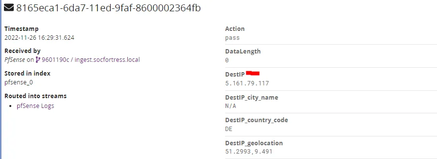

#### 3. Graylog invokes the GREYNOISE API and receives the response

#### 4. Graylog enriches the original log with the GREYNOISE response

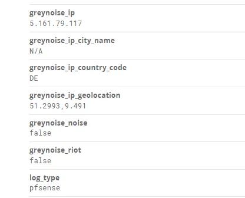

#### 5. Graylog writes the log to the SIEM Backend (Wazuh-Indexer)
---

##  **__Create Data Adapter__**

- Within Graylog, we first need to create a Data Adapter . The Data Adapter is where we configure the API request that will be made, such as the URL, Auth keys, Headers, etc.

#### 1. Navigate to System -> Lookup Tables and select Data Adapters .

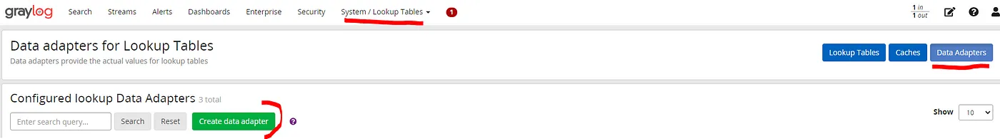

#### 2. Select GreyNoise Community IP Lookup and configure the Data Adapter with your API key.

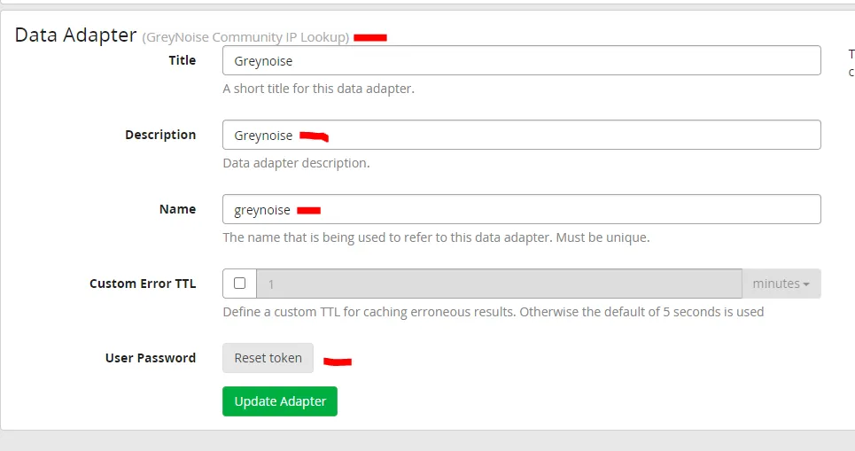

#### 3. Verify your API key is correct by testing a lookup for 45.83.66.207

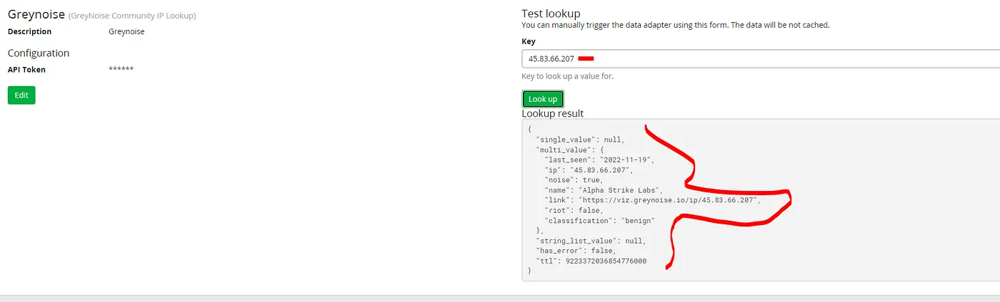
---

## **__Create Data Cache__**

- Another benefit with using Graylog is the built in Data Caching. Most API services limit the amount of API requests that end users are allowed to make over a given timeframe. This limitation results in our automated Threat Intel providing no value once our API limit has been reached.

- To combat this issue, we implement Graylog Data Caching. The caches are responsible for caching the lookup results to improve the lookup performance and/or to avoid overloading databases and APIs. Prior to invoking an API call to Greynoise, Graylog will first check the internal cache. If the DestIP was previously enriched with Greynoise API results, those entries are stored within the Graylog Data Cache, and there is no need for Graylog to invoke the Greynoise API again. Thus saving our API quota.

#### 1. Navigate to System -> Lookup Tables and select Caches .

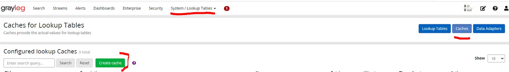

#### 2. Create the Cache to hold Greynoise API results.

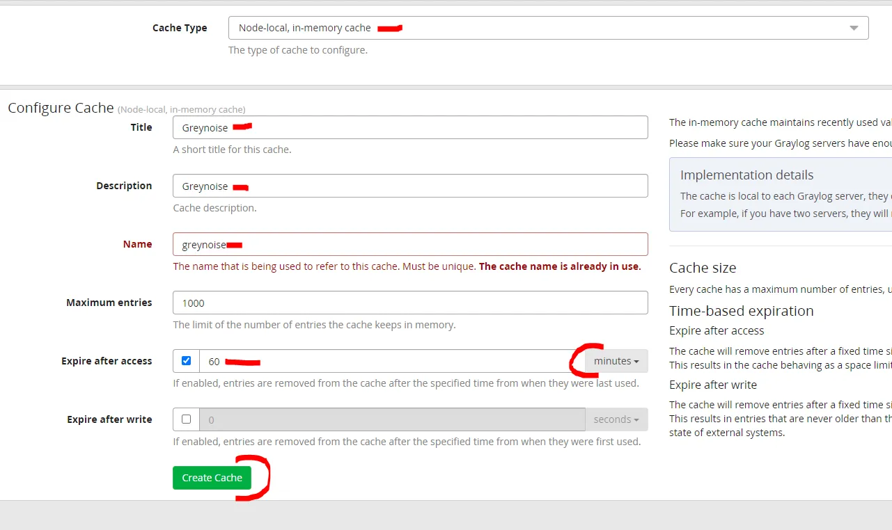
---

## **__Create Lookup Table__**

- The lookup table component ties together a data adapter instance and a cache instance. It is needed to actually enable the usage of the lookup table in extractors, converters, pipeline functions and decorators.

#### 1. Navigate to System -> Lookup Tables and select Lookup Tables .

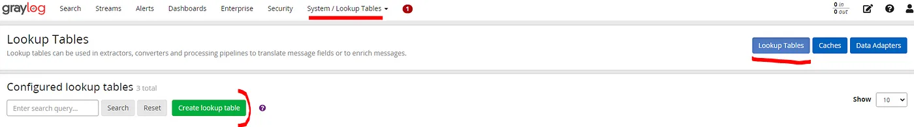

#### 2. Configure the Greynoise Lookup Table. Ensure you point to your previously created Data Adapter and Cache .

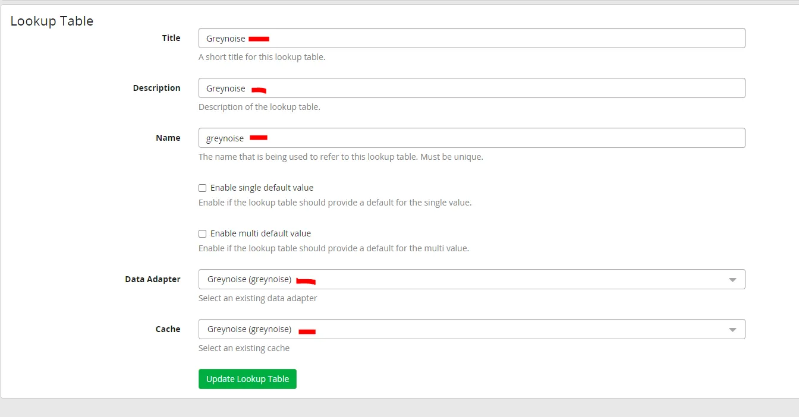
---

## **__Creating Pipeline Rule__**

- With our Lookup Table configured, we need to tell Graylog when we want to invoke the Greynoise API. This is acheived by creating a Pipeline Rule .

#### 1. Navigate to System -> Pipelines and select Manage rules.

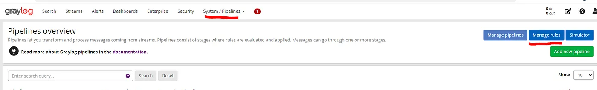

#### 2. Create the GreyNoise Lookup on DestIP Rule
```
rule "GreyNoise Lookup on DestIP"
when
    has_field("DestIP")
then
    let ldata = lookup(
        lookup_table: "greynoise",
        key: to_string($message.DestIP)
    );
    set_fields(
        fields: ldata,
        prefix: "greynoise_"
        );
end
```

- We are instructing Graylog to use the greynoise Lookup table only when the consumed log has the DestIP field. The set_fields function is responsible for enriching our log with the response back from Greynoise and adding the prefix of greynoise_ to every field name.

#### 3. Create the Greynoise Pipeline and add your wazuh stream.

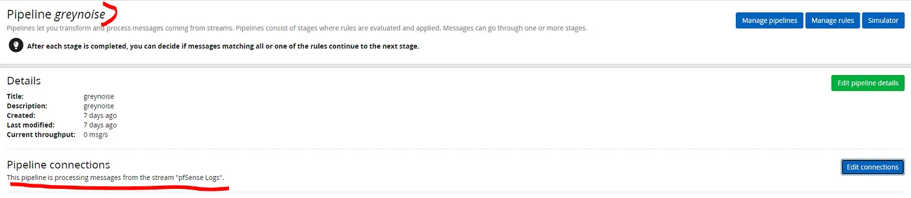

#### 4. Within Stage 0 add the GreyNoise Lookup on DestIP pipeline rule.

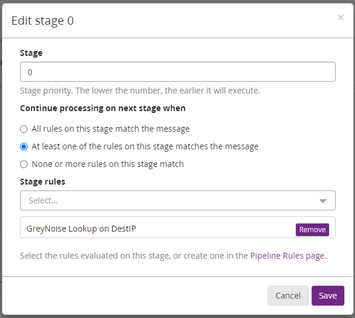

## Now you will get the result as following !!!!

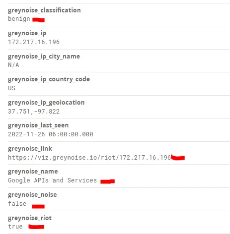
---

### You can now start to build dashboards, such as we did in Graylog-Wazuh configuration, and alerts to notify the SOC team when Greynoise detects a malicious IP address contained within your Wazuh logs!
