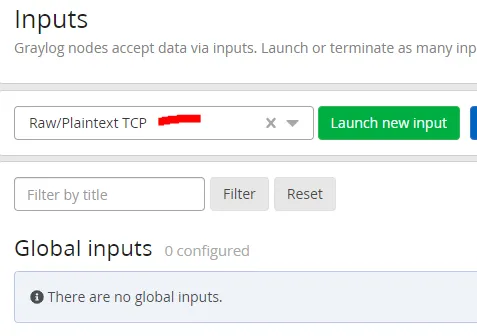
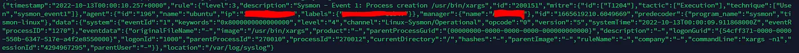
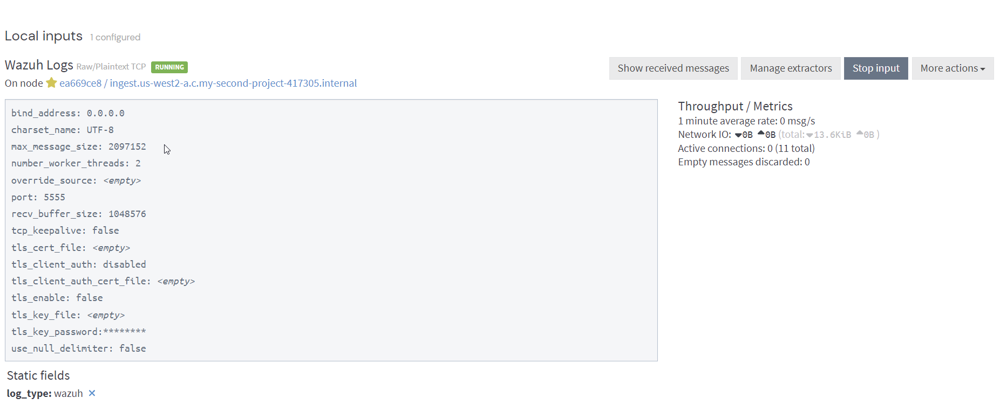

# Graylog and Wazuh configuration guide 

- Our Wazuh Manager is installed, but we need to send the Wazuh alerts to Graylog so it can work its magic and write the logs to our Wazuh-Indexer for storage and searching.
 
# **__STEPS__**

---

###  **__STAGE-1 : Configure Graylog Input__**

#### 1. Log into Graylog WebUI and navigate to System->Inputs.

#### 2. Launch a new Raw/Plaintext TCP input.



#### 3. Leave at default settings and select save. Graylog is now accepting TCP messages on port 5555.
---

###  **__STAGE-2 : Install Fluent-Bit on Wazuh Manager(Perform on wazuh-server)__**

#### 1. Wazuh Agent collects endpoint logs and sends to Manager.

#### 2. Manager compares received logs against its rulesets. If there is a match, the log is written to /var/ossec/logs/alerts/alerts.json .



#### 3. Fluent Bit reads the alerts.json file and sends its entries to our Graylog input.
```
$  curl https://raw.githubusercontent.com/fluent/fluent-bit/master/install.sh | sh
```

#### 4. Edit the /etc/fluent-bit/fluent-bit.conf to collect the alerts.json file and send it to Graylog:
```
[SERVICE]
    flush        5
    daemon       Off
    log_level    info
    parsers_file parsers.conf
    plugins_file plugins.conf
    http_server  Off
    http_listen  0.0.0.0
    http_port    2020
    storage.metrics on
    storage.path /var/log/flb-storage/
    storage.sync normal
    storage.checksum off
    storage.backlog.mem_limit 5M
    Log_File /var/log/td-agent-bit.log
[INPUT]
    name  tail
    path  /var/ossec/logs/alerts/alerts.json
    tag wazuh
    parser  json
    Buffer_Max_Size 5MB
    Buffer_Chunk_Size 400k
    storage.type      filesystem
    Mem_Buf_Limit     512MB
[OUTPUT]
    Name  tcp
    Host  *your graylog host*
    Port  *your graylog port*
    net.keepalive off
    Match wazuh
    Format  json_lines
    json_date_key true
```

#### 5. start the service
```
$  systemctl enable fluent-bit
$  systemctl start fluent-bit
```
---

###  **__STAGE-3 : Wazuh Manager Configurations(Registration Via Password)__**


#### 1. Enable the password authentication option by adding the configuration highlighted below to the <auth> section of the manager configuration file /var/ossec/etc/ossec.conf.
```
<auth>
  <use_password>yes</use_password>
</auth>
```

#### 2. Setting your own password. This is done by creating the file /var/ossec/etc/authd.pass on the manager with your password.
```
$  echo "<CUSTOM_PASSWORD>" > /var/ossec/etc/authd.pass #Replace <CUSTOM_PASSWORD> with your chosen agent enrollment password and run the following command:
```

#### 3. Change the authd.pass file permissions and ownership.
```
chmod 640 /var/ossec/etc/authd.pass
chown root:wazuh /var/ossec/etc/authd.pass
``` 

#### 4. In order to use Wazuh to run a vulnerability assessment on our endpoints, we must enable it via the Wazuh Managers /var/ossec/etc/ossec.conf file.
```
<vulnerability-detector>
    <enabled>yes</enabled>
    <interval>5m</interval>
    <min_full_scan_interval>6h</min_full_scan_interval>
    <run_on_start>yes</run_on_start>

    <!-- Ubuntu OS vulnerabilities -->
    <provider name="canonical">
      <enabled>yes</enabled>
      <os>trusty</os>
      <os>xenial</os>
      <os>bionic</os>
      <os>focal</os>
      <os>jammy</os>
      <update_interval>1h</update_interval>
    </provider>

    <!-- Debian OS vulnerabilities -->
    <provider name="debian">
      <enabled>yes</enabled>
      <os>stretch</os>
      <os>buster</os>
      <os>bullseye</os>
      <update_interval>1h</update_interval>
    </provider>

    <!-- RedHat OS vulnerabilities -->
    <provider name="redhat">
      <enabled>yes</enabled>
      <os>5</os>
      <os>6</os>
      <os>7</os>
      <os>8</os>
      <os>9</os>
      <update_interval>1h</update_interval>
    </provider>

    <!-- Amazon Linux OS vulnerabilities -->
    <provider name="alas">
      <enabled>yes</enabled>
      <os>amazon-linux</os>
      <os>amazon-linux-2</os>
      <update_interval>1h</update_interval>
    </provider>

    <!-- Arch OS vulnerabilities -->
    <provider name="arch">
      <enabled>yes</enabled>
      <update_interval>1h</update_interval>
    </provider>

    <!-- Windows OS vulnerabilities -->
    <provider name="msu">
      <enabled>yes</enabled>
      <update_interval>1h</update_interval>
    </provider>

    <!-- Aggregate vulnerabilities -->
    <provider name="nvd">
      <enabled>yes</enabled>
      <update_from_year>2010</update_from_year>
      <update_interval>1h</update_interval>
    </provider>

  </vulnerability-detector>
```

#### 5. Configure Agent Group Files

# LINUX GROUP
```
<agent_config>
	<client_buffer>
		<!-- Agent buffer options -->
		<disabled>no</disabled>
		<queue_size>5000</queue_size>
		<events_per_second>500</events_per_second>
	</client_buffer>
	<!-- Policy monitoring -->
	<rootcheck>
		<disabled>no</disabled>
		<!-- Frequency that rootcheck is executed - every 12 hours -->
		<frequency>43200</frequency>
		<rootkit_files>/var/ossec/etc/shared/rootkit_files.txt</rootkit_files>
		<rootkit_trojans>/var/ossec/etc/shared/rootkit_trojans.txt</rootkit_trojans>
		<system_audit>/var/ossec/etc/shared/system_audit_rcl.txt</system_audit>
		<system_audit>/var/ossec/etc/shared/system_audit_ssh.txt</system_audit>
		<system_audit>/var/ossec/etc/shared/cis_debian_linux_rcl.txt</system_audit>
		<skip_nfs>yes</skip_nfs>
	</rootcheck>
	<wodle name="open-scap">
		<disabled>yes</disabled>
		<timeout>1800</timeout>
		<interval>1d</interval>
		<scan-on-start>yes</scan-on-start>
		<content type="xccdf" path="ssg-debian-8-ds.xml">
			<profile>xccdf_org.ssgproject.content_profile_common</profile>
		</content>
		<content type="oval" path="cve-debian-oval.xml"/>
	</wodle>
	<!-- File integrity monitoring -->
	<syscheck>
		<disabled>no</disabled>
		<!-- Frequency that syscheck is executed default every 12 hours -->
		<frequency>43200</frequency>
		<scan_on_start>yes</scan_on_start>
		<!-- Directories to check  (perform all possible verifications) -->
		<directories>/etc,/usr/bin,/usr/sbin</directories>
		<directories>/bin,/sbin,/boot</directories>
		<!-- Files/directories to ignore -->
		<ignore>/etc/mtab</ignore>
		<ignore>/etc/hosts.deny</ignore>
		<ignore>/etc/mail/statistics</ignore>
		<ignore>/etc/random-seed</ignore>
		<ignore>/etc/random.seed</ignore>
		<ignore>/etc/adjtime</ignore>
		<ignore>/etc/httpd/logs</ignore>
		<ignore>/etc/utmpx</ignore>
		<ignore>/etc/wtmpx</ignore>
		<ignore>/etc/cups/certs</ignore>
		<ignore>/etc/dumpdates</ignore>
		<ignore>/etc/svc/volatile</ignore>
		<ignore>/sys/kernel/security</ignore>
		<ignore>/sys/kernel/debug</ignore>
		<!-- File types to ignore -->
		<ignore type="sregex">.log$|.swp$</ignore>
		<!-- Check the file, but never compute the diff -->
		<nodiff>/etc/ssl/private.key</nodiff>
		<skip_nfs>yes</skip_nfs>
		<skip_dev>yes</skip_dev>
		<skip_proc>yes</skip_proc>
		<skip_sys>yes</skip_sys>
		<!-- Nice value for Syscheck process -->
		<process_priority>10</process_priority>
		<!-- Maximum output throughput -->
		<max_eps>100</max_eps>
		<!-- Database synchronization settings -->
		<synchronization>
			<enabled>yes</enabled>
			<interval>5m</interval>
			<response_timeout>30</response_timeout>
			<queue_size>16384</queue_size>
			<max_eps>10</max_eps>
		</synchronization>
	</syscheck>
	<!-- Log analysis -->
	<localfile>
		<log_format>syslog</log_format>
		<location>/var/ossec/logs/active-responses.log</location>
	</localfile>
	<localfile>
		<log_format>syslog</log_format>
		<location>/var/log/messages</location>
	</localfile>
	<localfile>
		<log_format>syslog</log_format>
		<location>/var/log/auth.log</location>
	</localfile>
	<localfile>
		<log_format>syslog</log_format>
		<location>/var/log/syslog</location>
	</localfile>
	<localfile>
		<log_format>command</log_format>
		<command>df -P</command>
		<frequency>360</frequency>
	</localfile>
	<localfile>
		<log_format>full_command</log_format>
		<command>netstat -tan |grep LISTEN |grep -v 127.0.0.1 | sort</command>
		<frequency>360</frequency>
	</localfile>
	<localfile>
		<log_format>full_command</log_format>
		<command>last -n 5</command>
		<frequency>360</frequency>
	</localfile>
	<wodle name="osquery">
		<disabled>yes</disabled>
		<run_daemon>yes</run_daemon>
		<log_path>/var/log/osquery/osqueryd.results.log</log_path>
		<config_path>/etc/osquery/osquery.conf</config_path>
		<add_labels>yes</add_labels>
	</wodle>
	<wodle name="syscollector">
		<disabled>no</disabled>
		<interval>24h</interval>
		<scan_on_start>yes</scan_on_start>
		<packages>yes</packages>
		<os>yes</os>
		<hotfixes>yes</hotfixes>
		<ports all="no">yes</ports>
		<processes>yes</processes>
	</wodle>
</agent_config>
```

# WINDOWS GROUP
```
<agent_config>
	<client_buffer>
		<!-- Agent buffer options -->
		<disabled>no</disabled>
		<queue_size>5000</queue_size>
		<events_per_second>500</events_per_second>
	</client_buffer>
	<!-- Policy monitoring -->
	<rootcheck>
		<disabled>no</disabled>
		<windows_apps>./shared/win_applications_rcl.txt</windows_apps>
		<windows_malware>./shared/win_malware_rcl.txt</windows_malware>
	</rootcheck>
	<sca>
		<enabled>yes</enabled>
		<scan_on_start>yes</scan_on_start>
		<interval>12h</interval>
		<skip_nfs>yes</skip_nfs>
	</sca>
	<!-- File integrity monitoring -->
	<syscheck>
		<disabled>no</disabled>
		<!-- Frequency that syscheck is executed default every 12 hours -->
		<frequency>43200</frequency>
		<!-- Default files to be monitored. -->
		<directories recursion_level="0" restrict="regedit.exe$|system.ini$|win.ini$">%WINDIR%</directories>
		<directories recursion_level="0" restrict="at.exe$|attrib.exe$|cacls.exe$|cmd.exe$|eventcreate.exe$|ftp.exe$|lsass.exe$|net.exe$|net1.exe$|netsh.exe$|reg.exe$|regedt32.exe|regsvr32.exe|runas.exe|sc.exe|schtasks.exe|sethc.exe|subst.exe$">%WINDIR%\SysNative</directories>
		<directories recursion_level="0">%WINDIR%\SysNative\drivers\etc</directories>
		<directories recursion_level="0" restrict="WMIC.exe$">%WINDIR%\SysNative\wbem</directories>
		<directories recursion_level="0" restrict="powershell.exe$">%WINDIR%\SysNative\WindowsPowerShell\v1.0</directories>
		<directories recursion_level="0" restrict="winrm.vbs$">%WINDIR%\SysNative</directories>
		<!-- 32-bit programs. -->
		<directories recursion_level="0" restrict="at.exe$|attrib.exe$|cacls.exe$|cmd.exe$|eventcreate.exe$|ftp.exe$|lsass.exe$|net.exe$|net1.exe$|netsh.exe$|reg.exe$|regedit.exe$|regedt32.exe$|regsvr32.exe$|runas.exe$|sc.exe$|schtasks.exe$|sethc.exe$|subst.exe$">%WINDIR%\System32</directories>
		<directories recursion_level="0">%WINDIR%\System32\drivers\etc</directories>
		<directories recursion_level="0" restrict="WMIC.exe$">%WINDIR%\System32\wbem</directories>
		<directories recursion_level="0" restrict="powershell.exe$">%WINDIR%\System32\WindowsPowerShell\v1.0</directories>
		<directories recursion_level="0" restrict="winrm.vbs$">%WINDIR%\System32</directories>
		<directories realtime="yes">%PROGRAMDATA%\Microsoft\Windows\Start Menu\Programs\Startup</directories>
		<ignore>%PROGRAMDATA%\Microsoft\Windows\Start Menu\Programs\Startup\desktop.ini</ignore>
		<ignore type="sregex">.log$|.htm$|.jpg$|.png$|.chm$|.pnf$|.evtx$</ignore>
		<!-- Windows registry entries to monitor. -->
		<windows_registry>HKEY_LOCAL_MACHINE\Software\Classes\batfile</windows_registry>
		<windows_registry>HKEY_LOCAL_MACHINE\Software\Classes\cmdfile</windows_registry>
		<windows_registry>HKEY_LOCAL_MACHINE\Software\Classes\comfile</windows_registry>
		<windows_registry>HKEY_LOCAL_MACHINE\Software\Classes\exefile</windows_registry>
		<windows_registry>HKEY_LOCAL_MACHINE\Software\Classes\piffile</windows_registry>
		<windows_registry>HKEY_LOCAL_MACHINE\Software\Classes\AllFilesystemObjects</windows_registry>
		<windows_registry>HKEY_LOCAL_MACHINE\Software\Classes\Directory</windows_registry>
		<windows_registry>HKEY_LOCAL_MACHINE\Software\Classes\Folder</windows_registry>
		<windows_registry arch="both">HKEY_LOCAL_MACHINE\Software\Classes\Protocols</windows_registry>
		<windows_registry arch="both">HKEY_LOCAL_MACHINE\Software\Policies</windows_registry>
		<windows_registry>HKEY_LOCAL_MACHINE\Security</windows_registry>
		<windows_registry arch="both">HKEY_LOCAL_MACHINE\Software\Microsoft\Internet Explorer</windows_registry>
		<windows_registry>HKEY_LOCAL_MACHINE\System\CurrentControlSet\Services</windows_registry>
		<windows_registry>HKEY_LOCAL_MACHINE\System\CurrentControlSet\Control\Session Manager\KnownDLLs</windows_registry>
		<windows_registry>HKEY_LOCAL_MACHINE\System\CurrentControlSet\Control\SecurePipeServers\winreg</windows_registry>
		<windows_registry arch="both">HKEY_LOCAL_MACHINE\Software\Microsoft\Windows\CurrentVersion\Run</windows_registry>
		<windows_registry arch="both">HKEY_LOCAL_MACHINE\Software\Microsoft\Windows\CurrentVersion\RunOnce</windows_registry>
		<windows_registry>HKEY_LOCAL_MACHINE\Software\Microsoft\Windows\CurrentVersion\RunOnceEx</windows_registry>
		<windows_registry arch="both">HKEY_LOCAL_MACHINE\Software\Microsoft\Windows\CurrentVersion\URL</windows_registry>
		<windows_registry arch="both">HKEY_LOCAL_MACHINE\Software\Microsoft\Windows\CurrentVersion\Policies</windows_registry>
		<windows_registry arch="both">HKEY_LOCAL_MACHINE\Software\Microsoft\Windows NT\CurrentVersion\Windows</windows_registry>
		<windows_registry arch="both">HKEY_LOCAL_MACHINE\Software\Microsoft\Windows NT\CurrentVersion\Winlogon</windows_registry>
		<windows_registry arch="both">HKEY_LOCAL_MACHINE\Software\Microsoft\Active Setup\Installed Components</windows_registry>
		<!-- Windows registry entries to ignore. -->
		<registry_ignore>HKEY_LOCAL_MACHINE\Security\Policy\Secrets</registry_ignore>
		<registry_ignore>HKEY_LOCAL_MACHINE\Security\SAM\Domains\Account\Users</registry_ignore>
		<registry_ignore type="sregex">\Enum$</registry_ignore>
		<registry_ignore>HKEY_LOCAL_MACHINE\System\CurrentControlSet\Services\MpsSvc\Parameters\AppCs</registry_ignore>
		<registry_ignore>HKEY_LOCAL_MACHINE\System\CurrentControlSet\Services\MpsSvc\Parameters\PortKeywords\DHCP</registry_ignore>
		<registry_ignore>HKEY_LOCAL_MACHINE\System\CurrentControlSet\Services\MpsSvc\Parameters\PortKeywords\IPTLSIn</registry_ignore>
		<registry_ignore>HKEY_LOCAL_MACHINE\System\CurrentControlSet\Services\MpsSvc\Parameters\PortKeywords\IPTLSOut</registry_ignore>
		<registry_ignore>HKEY_LOCAL_MACHINE\System\CurrentControlSet\Services\MpsSvc\Parameters\PortKeywords\RPC-EPMap</registry_ignore>
		<registry_ignore>HKEY_LOCAL_MACHINE\System\CurrentControlSet\Services\MpsSvc\Parameters\PortKeywords\Teredo</registry_ignore>
		<registry_ignore>HKEY_LOCAL_MACHINE\System\CurrentControlSet\Services\PolicyAgent\Parameters\Cache</registry_ignore>
		<registry_ignore>HKEY_LOCAL_MACHINE\Software\Microsoft\Windows\CurrentVersion\RunOnceEx</registry_ignore>
		<registry_ignore>HKEY_LOCAL_MACHINE\System\CurrentControlSet\Services\ADOVMPPackage\Final</registry_ignore>
		<!-- Frequency for ACL checking (seconds) -->
		<windows_audit_interval>60</windows_audit_interval>
		<!-- Nice value for Syscheck module -->
		<process_priority>10</process_priority>
		<!-- Maximum output throughput -->
		<max_eps>100</max_eps>
		<!-- Database synchronization settings -->
		<synchronization>
			<enabled>yes</enabled>
			<interval>5m</interval>
			<max_interval>1h</max_interval>
			<max_eps>10</max_eps>
		</synchronization>
	</syscheck>
	<!-- System inventory -->
	<wodle name="syscollector">
		<disabled>no</disabled>
		<interval>1h</interval>
		<scan_on_start>yes</scan_on_start>
		<hardware>yes</hardware>
		<os>yes</os>
		<network>yes</network>
		<packages>yes</packages>
		<ports all="no">yes</ports>
		<processes>yes</processes>
		<!-- Database synchronization settings -->
		<synchronization>
			<max_eps>10</max_eps>
		</synchronization>
	</wodle>
	<!-- CIS policies evaluation -->
	<wodle name="cis-cat">
		<disabled>yes</disabled>
		<timeout>1800</timeout>
		<interval>1d</interval>
		<scan-on-start>yes</scan-on-start>
		<java_path>\\server\jre\bin\java.exe</java_path>
		<ciscat_path>C:\cis-cat</ciscat_path>
	</wodle>
	<!-- Osquery integration -->
	<wodle name="osquery">
		<disabled>yes</disabled>
		<run_daemon>yes</run_daemon>
		<bin_path>C:\Program Files\osquery\osqueryd</bin_path>
		<log_path>C:\Program Files\osquery\log\osqueryd.results.log</log_path>
		<config_path>C:\Program Files\osquery\osquery.conf</config_path>
		<add_labels>yes</add_labels>
	</wodle>
	<!-- Active response -->
	<active-response>
		<disabled>no</disabled>
		<ca_store>wpk_root.pem</ca_store>
		<ca_verification>yes</ca_verification>
	</active-response>
	<!-- Log analysis -->
	<localfile>
		<location>Microsoft-Windows-Sysmon/Operational</location>
		<log_format>eventchannel</log_format>
	</localfile>
	<localfile>
		<location>Windows PowerShell</location>
		<log_format>eventchannel</log_format>
	</localfile>
	<localfile>
		<location>Microsoft-Windows-CodeIntegrity/Operational</location>
		<log_format>eventchannel</log_format>
	</localfile>
	<localfile>
		<location>Microsoft-Windows-TaskScheduler/Operational</location>
		<log_format>eventchannel</log_format>
	</localfile>
	<localfile>
		<location>Microsoft-Windows-PowerShell/Operational</location>
		<log_format>eventchannel</log_format>
	</localfile>
	<localfile>
		<location>Microsoft-Windows-Windows Firewall With Advanced Security/Firewall</location>
		<log_format>eventchannel</log_format>
	</localfile>
	<localfile>
		<location>Microsoft-Windows-Windows Defender/Operational</location>
		<log_format>eventchannel</log_format>
	</localfile>
</agent_config>
```

#### 6. Restart Wazuh Manager.
```
$  systemctl restart wazuh-manager
```

### After you complete these step you must get the data flow from the wazuh to your graylog input which we have cerated realier.


---

## Note :

- Here we have done the basic configurations but it is recommanded that you also follow some extra steps to configure the system properly. The reference for extra configurations is given below

### __[Wazuh Agent Install — Deploy the Wazuh Agent to your endpoints.](https://socfortress.medium.com/part-4-wazuh-agent-install-endpoint-monitoring-f24f6a0464ac)__

### __[Intelligent SIEM Logging — Take control of your logs with Graylog.](https://medium.com/@socfortress/part-5-intelligent-siem-logging-4d0656c0da5b)__
 ---


