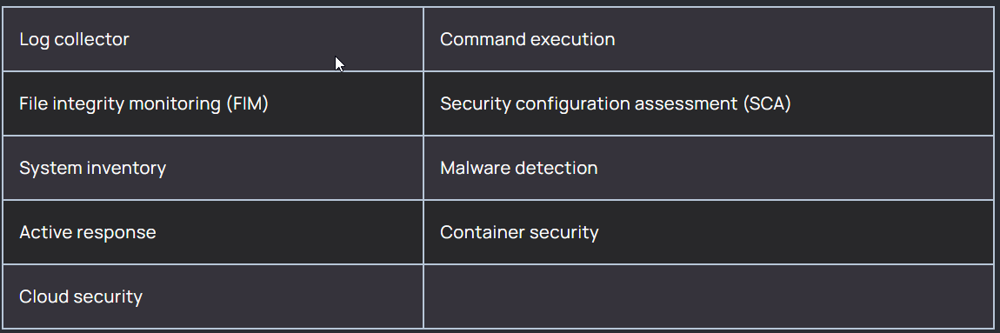

# **__Wazuh Agents Installation and Configuration(Wazuh 4.7)__**

#### - The Wazuh agent is multi-platform and runs on the endpoints that the user wants to monitor. It communicates with the Wazuh server, sending data in near real-time through an encrypted and authenticated channel.

#### - The agent was developed considering the need to monitor a wide variety of different endpoints without impacting their performance. It is supported on the most popular operating systems, and it requires 35 MB of RAM on average.

#### - The Wazuh agent provides key features to enhance your system’s security.



## **__[REFERENCE (Important !!!)](https://documentation.wazuh.com/current/installation-guide/wazuh-agent/index.html)__**

#### - __*Very Important Note*__ (Your machine should allow SSH trafic on specified ports) OR else you can configure the machine such that it allows all traffic on all ports if you want to change the port configs.

##### - You can modify the traffic policies as per security requirement in your organization !!!

## **HERE I HAVE CONFIGURED WAZUH AGENTS ONLY ON LINUX MACHINE, BY REFERRING THE GIVEN LINK YOU INSTALL SAME FOR OTHER OPERATING SYSTEMS ALSO**

#### [you can refer this youtube video (**ONLY FOR INSTALLING WAZUH AGENT**)](https://youtu.be/jByhKaK7STg?si=drsHbBpiBgE79E-i)

#### The agent runs on the host you want to monitor and communicates with the Wazuh server, sending data in near real-time through an encrypted and authenticated channel.

##(YOU CAN ALSO ADD THE AGENT USING WAZUH DASHBOARD !!!)
#### - You can also deploy a new agent following the instructions in the Wazuh dashboard. Go to Wazuh > Agents, and click on Deploy new agent.


#STEPS

#### 1. Install the GPG key:
```
$  curl -s https://packages.wazuh.com/key/GPG-KEY-WAZUH | gpg --no-default-keyring --keyring gnupg-ring:/usr/share/keyrings/wazuh.gpg --import && chmod 644 /usr/share/keyrings/wazuh.gpg
```

#### 2. Add the repository:
```
$  echo "deb [signed-by=/usr/share/keyrings/wazuh.gpg] https://packages.wazuh.com/4.x/apt/ stable main" | tee -a /etc/apt/sources.list.d/wazuh.list
```

#### 3. Update the package information:
```
$  apt-get update
```

#### 4. To deploy the Wazuh agent on your endpoint, select your package manager and edit the WAZUH_MANAGER variable to contain your Wazuh manager IP address or hostname.
```
WAZUH_MANAGER="10.0.0.2" apt-get install wazuh-agent #change WAZUH_MANAGER variable with public IP address of your wazuh server
```

#### 5. Enable and start the Wazuh agent service.
```
$  systemctl daemon-reload
$  systemctl enable wazuh-agent
$  systemctl start wazuh-agent
```

## Now you can verify that your agent is connected or not by simply seeing it in Wazuh Dashboard OR using "tail -f /var/ossec/logs/ossec.log" command.


