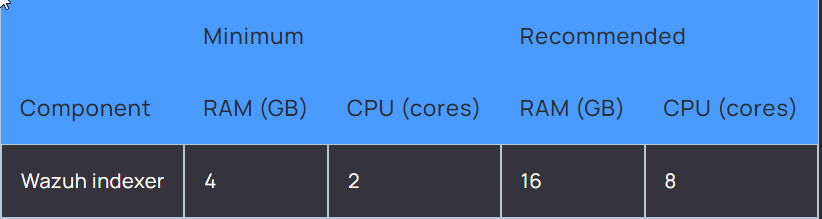
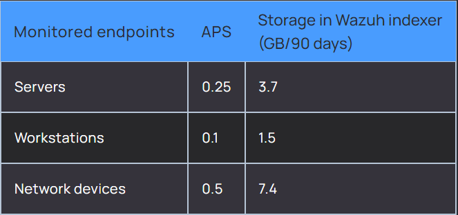
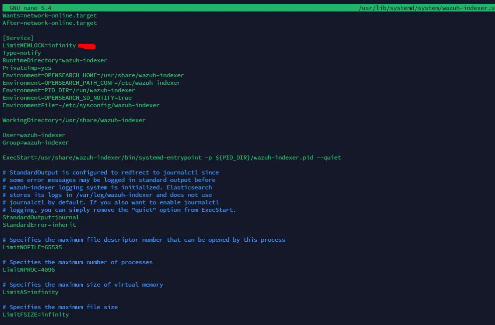
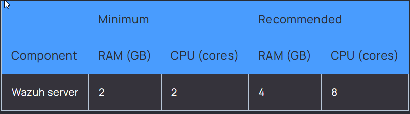
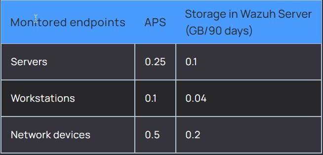
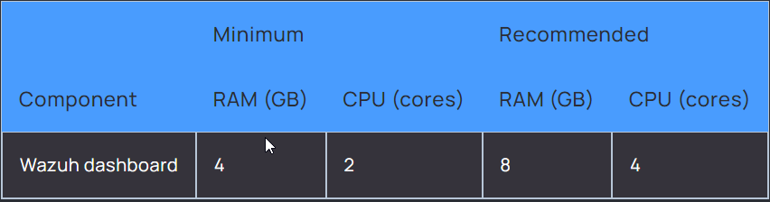
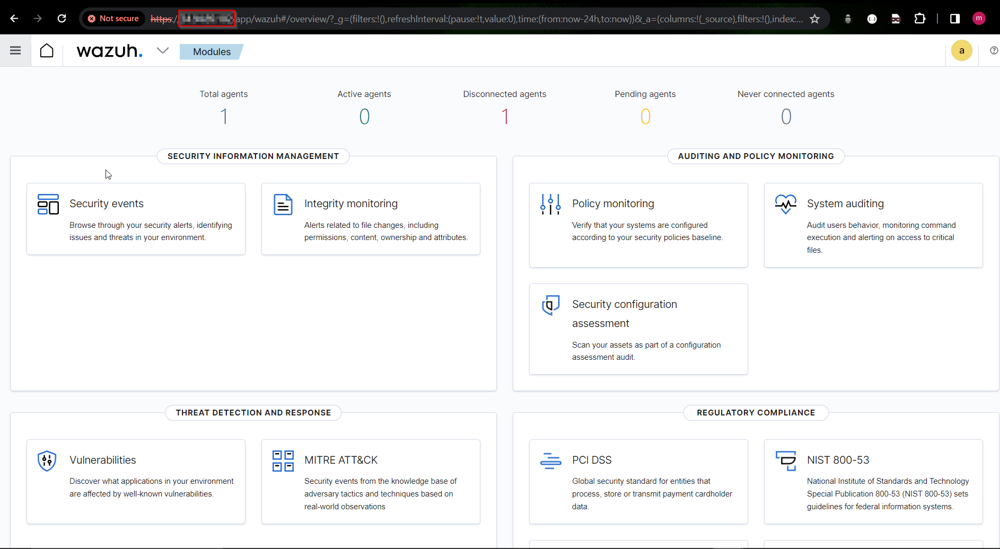

# **__Wazuh Server Installation and Configuration(Wazuh 4.7)__**

Wazuh is a security platform that provides unified XDR and SIEM protection for endpoints and cloud workloads. The solution is composed of a single universal agent and three central components: the Wazuh server, the Wazuh indexer, and the Wazuh dashboard.


Wazuh is free and open source. Its components abide by the [GNU General Public License, version 2](https://www.gnu.org/licenses/old-licenses/gpl-2.0.en.html), and the [Apache License, Version 2.0 (ALv2)](https://www.apache.org/licenses/LICENSE-2.0).

## **__[REFERENCE (Important !!!)](https://documentation.wazuh.com/current/installation-guide/index.html)__**

#### - Create a VM instance on AWS / GCE (any  other cloud computing platform) with allocation of static _IP address_ and specified hardware requirements.

#### - __*Very Important Note*__ (Your machine should allow SSH traffic on specified ports) OR else you can configure the machine such that it allows all traffic on all ports if you want to change the port configs.

- You can modify the traffic policies as per security requirement in your organization !!!

---

# **__STEP - 1 : INSTALLING WAZUH-INDEXER__**

---

# Requirements

### **Recommended operating systems**

Wazuh central components can be installed on a 64-bit Linux operating system. Wazuh recommends any of the following operating system versions:


### **Hardware recommendations**

Hardware requirements highly depend on the number of protected endpoints and cloud workloads. This number can help estimate how much data will be analyzed and how many security alerts will be stored and indexed.


For larger environments we recommend a distributed deployment. Multi-node cluster configuration is available for the Wazuh server and for the Wazuh indexer, providing high availability and load balancing.

* Hardware recommendations for each node



* Disk space requirements

The amount of data depends on the generated alerts per second (APS). This table details the estimated disk space needed per agent to store 90 days of alerts on a Wazuh indexer server, depending on the type of monitored endpoints.



---
# Wazuh indexer cluster installation
---

#### **__STAGE - 1 : Certificates creation__**

#### 1. Download the wazuh-certs-tool.sh script and the config.yml configuration file. This creates the certificates that encrypt communications between the Wazuh central components.
```
$  curl -sO https://packages.wazuh.com/4.7/wazuh-certs-tool.sh
$  curl -sO https://packages.wazuh.com/4.7/config.yml
```

#### 2. Edit ./config.yml and replace the node names and IP values with the corresponding names and IP addresses. You need to do this for all Wazuh server, Wazuh indexer, and Wazuh dashboard nodes. Add as many node fields as needed.(YOUR FILE MUST LOOK LIKE GIVEN FILE)
```
nodes:
  # Wazuh indexer nodes
  indexer:
    - name: ingest
      ip: "YOUR_SERVER_PUBLIC_IP"
    #- name: node-2
    #  ip: "<indexer-node-ip>"
    #- name: node-3
    #  ip: "<indexer-node-ip>"

  # Wazuh server nodes
  # If there is more than one Wazuh server
  # node, each one must have a node_type
  server:
    - name: wazuh-ingest
      ip: "YOUR_SERVER_PUBLIC_IP"
    #  node_type: master
    #- name: wazuh-2
    #  ip: "<wazuh-manager-ip>"
    #  node_type: worker
    #- name: wazuh-3
    #  ip: "<wazuh-manager-ip>"
    #  node_type: worker

  # Wazuh dashboard nodes
  dashboard:
    - name: dashboard
      ip: "YOUR_SERVER_PUBLIC_IP"
```

#### 3. Run ./wazuh-certs-tool.sh to create the certificates. For a multi-node cluster, these certificates need to be later deployed to all Wazuh instances in your cluster.
```
$  bash ./wazuh-certs-tool.sh -A
```

#### 4. Compress all the necessary files.
```
$  tar -cvf ./wazuh-certificates.tar -C ./wazuh-certificates/ .
$  rm -rf ./wazuh-certificates
```

#### 5. Copy the wazuh-certificates.tar file to all the nodes, including the Wazuh indexer, Wazuh server, and Wazuh dashboard nodes. This can be done by using the scp utility.
---

#### **__STAGE - 2 : Nodes installation__**

#### 1. Install the following packages if missing:
```
$  apt-get install debconf adduser procps
```

#### 2. Install the following packages if missing.
```
$  apt-get install gnupg apt-transport-https
```

#### 3. Install the GPG key.
```
$  curl -s https://packages.wazuh.com/key/GPG-KEY-WAZUH | gpg --no-default-keyring --keyring gnupg-ring:/usr/share/keyrings/wazuh.gpg --import && chmod 644 /usr/share/keyrings/wazuh.gpg
```

#### 4. Add the repository.
```
$  echo "deb [signed-by=/usr/share/keyrings/wazuh.gpg] https://packages.wazuh.com/4.x/apt/ stable main" | tee -a /etc/apt/sources.list.d/wazuh.list
```

#### 5. Update the packages information.
```
$  apt-get update
```

#### 6. Install the Wazuh indexer package.
```
$  apt-get -y install wazuh-indexer
```
---

#### **__STAGE - 3 : Configuring the Wazuh indexer__**

### 1. Edit the /etc/wazuh-indexer/opensearch.yml configuration file and replace the following values:
* a. network.host: Sets the address of this node for both HTTP and transport traffic. The node will bind to this address and use it as its publish address. Accepts an IP address or a hostname.

Use the same node address set in config.yml to create the SSL certificates.

* b. node.name: Name of the Wazuh indexer node as defined in the config.yml file. For example, node-1.

* c. cluster.initial_master_nodes: List of the names of the master-eligible nodes. These names are defined in the config.yml file. Uncomment the node-2 and node-3 lines, change the names, or add more lines, according to your config.yml definitions.
```
cluster.initial_master_nodes:
- "node-1"
- "node-2"
- "node-3"
```

* d. discovery.seed_hosts: List of the addresses of the master-eligible nodes. Each element can be either an IP address or a hostname. You may leave this setting commented if you are configuring the Wazuh indexer as a single node. For multi-node configurations, uncomment this setting and set the IP addresses of each master-eligible node.
```
discovery.seed_hosts:
  - "10.0.0.1"
  - "10.0.0.2"
  - "10.0.0.3"
```

* e. plugins.security.nodes_dn: List of the Distinguished Names of the certificates of all the Wazuh indexer cluster nodes. Uncomment the lines for node-2 and node-3 and change the common names (CN) and values according to your settings and your config.yml definitions.
```
plugins.security.nodes_dn:
- "CN=node-1,OU=Wazuh,O=Wazuh,L=California,C=US"
- "CN=node-2,OU=Wazuh,O=Wazuh,L=California,C=US"
- "CN=node-3,OU=Wazuh,O=Wazuh,L=California,C=US"
```
---

#### **__STAGE - 4 : Deploying certificates__**

#### 1. Run the following commands replacing <indexer-node-name> with the name of the Wazuh indexer node you are configuring as defined in config.yml. For example, node-1. This deploys the SSL certificates to encrypt communications between the Wazuh central components.
```
$  NODE_NAME=<indexer-node-name>
```

```
$  mkdir /etc/wazuh-indexer/certs
$  tar -xf ./wazuh-certificates.tar -C /etc/wazuh-indexer/certs/ ./$NODE_NAME.pem ./$NODE_NAME-key.pem ./admin.pem ./admin-key.pem ./root-ca.pem
$  mv -n /etc/wazuh-indexer/certs/$NODE_NAME.pem /etc/wazuh-indexer/certs/indexer.pem
$  mv -n /etc/wazuh-indexer/certs/$NODE_NAME-key.pem /etc/wazuh-indexer/certs/indexer-key.pem
$  chmod 500 /etc/wazuh-indexer/certs
$  chmod 400 /etc/wazuh-indexer/certs/*
$  chown -R wazuh-indexer:wazuh-indexer /etc/wazuh-indexer/certs
```

#### 2. Recommended action: If no other Wazuh components are going to be installed on this node, remove the wazuh-certificates.tar file by running rm -f ./wazuh-certificates.tar to increase security.
---

#### **__STAGE - 5 :  Memory Locking__**
Wazuh-indexer malfunctions when the system is swapping memory. It is crucial for the health of the node that none of the JVM is ever swapped out to disk. The following steps show how to set the bootstrap.memory_lock setting to true so wazuh-indexer will lock the process address space into RAM. This prevents any wazuh-indexer memory from being swapped out.

#### 1. Set bootstrap.memory_lock, Uncomment or add this line to the /etc/wazuh-indexer/opensearch.yml file:
```
bootstrap.memory_lock: true
```

#### 2. Edit the limit of system resources:
```
$  nano /usr/lib/systemd/system/wazuh-indexer.service

[Service]
LimitMEMLOCK=infinity
```



#### 3. Limit Memory
* The previous configuration might cause node instability or even node death with an OutOfMemory exception if wazuh-indexer tries to allocate more memory than is available. JVM heap limits will help limit memory usage and prevent this situation. Two rules must be applied when setting wazuh-indexer's heap size:
* 1. Use no more than 50% of available RAM.
* 2. Use no more than 32 GB.
* It is also important to consider the memory usage of the operating system, services and software running on the host. By default, wazuh-indexer is configured with a heap of 1 GB. It can be changed via JVM flags using the /etc/wazuh-indexer/jvm.options file:
```
# Xms represents the initial size of total heap space
# Xmx represents the maximum size of total heap space
-Xms4g
-Xmx4g
```

#### 4. Enable and start the Wazuh indexer service.
```
$  systemctl daemon-reload
$  systemctl enable wazuh-indexer
$  systemctl start wazuh-indexer
```
---

#### **__STAGE - 6 :  Cluster initialization__**

#### 1. Run the Wazuh indexer indexer-security-init.sh script on any Wazuh indexer node to load the new certificates information and start the single-node or multi-node cluster.
```
$  /usr/share/wazuh-indexer/bin/indexer-security-init.sh
```

#### 2. Testing the cluster installation, Replace <WAZUH_INDEXER_IP> and run the following commands to confirm that the installation is successful.
```
$  curl -k -u admin:admin https://<WAZUH_INDEXER_IP>:9200
```

## OUTPUT : 
```
{
  "name" : "node-1",
  "cluster_name" : "wazuh-cluster",
  "cluster_uuid" : "095jEW-oRJSFKLz5wmo5PA",
  "version" : {
    "number" : "7.10.2",
    "build_type" : "rpm",
    "build_hash" : "db90a415ff2fd428b4f7b3f800a51dc229287cb4",
    "build_date" : "2023-06-03T06:24:25.112415503Z",
    "build_snapshot" : false,
    "lucene_version" : "9.6.0",
    "minimum_wire_compatibility_version" : "7.10.0",
    "minimum_index_compatibility_version" : "7.0.0"
  },
  "tagline" : "The OpenSearch Project: https://opensearch.org/"
}
```

#### 3. Replace <WAZUH_INDEXER_IP> and run the following command to check if the single-node or multi-node cluster is working correctly.
```
curl -k -u admin:admin https://<WAZUH_INDEXER_IP>:9200/_cat/nodes?v
```
---
---
## **__STEP - 2 : INSTALLING WAZUH-SERVER(MANAGER)__**

---

# Requirements

### **Hardware recommendations**

Hardware requirements highly depend on the number of protected endpoints and cloud workloads. This number can help estimate how much data will be analyzed and how many security alerts will be stored and indexed.


For larger environments we recommend a distributed deployment. Multi-node cluster configuration is available for the Wazuh server and for the Wazuh indexer, providing high availability and load balancing.

* Hardware recommendations for each node



* Disk space requirements

The amount of data depends on the generated alerts per second (APS). This table details the estimated disk space needed per agent to store 90 days of alerts on a Wazuh indexer server, depending on the type of monitored endpoints.




#### **__STAGE - 1 : Wazuh server node installation__**

#### 1. Install the following packages if missing.
```
$  apt-get install gnupg apt-transport-https
```

#### 2. Install the GPG key.
```
$  curl -s https://packages.wazuh.com/key/GPG-KEY-WAZUH | gpg --no-default-keyring --keyring gnupg-ring:/usr/share/keyrings/wazuh.gpg --import && chmod 644 /usr/share/keyrings/wazuh.gpg
```

#### 3. Add the repository.
```
$  echo "deb [signed-by=/usr/share/keyrings/wazuh.gpg] https://packages.wazuh.com/4.x/apt/ stable main" | tee -a /etc/apt/sources.list.d/wazuh.list
```

#### 4. Update the packages information.
```
$  apt-get update
```

#### 5. Install the Wazuh manager package.
```
$  apt-get -y install wazuh-manager
```

#### 6. Enable and start the Wazuh manager service.
```
$  systemctl daemon-reload
$  systemctl enable wazuh-manager
$  systemctl start wazuh-manager
```

#### 7. Run the following command to verify the Wazuh manager status.
```
$  systemctl status wazuh-manager
```

#### - __*Very Important Note*__ Here we shall not use filebeat for transmitting the logs to other server which is new in my project stack, we shall use graylog 3rd party dependencies for the transmission !!!!!

---
---

## **__STEP - 3 : INSTALLING WAZUH-DASHBOARD__**

---

# Requirements

### **Hardware recommendations**

* Hardware recommendations 



### **Browser compatibility**

Wazuh dashboard supports the following web browsers:

- Chrome 95 or later

- Firefox 93 or later

- Safari 13.7 or later

- Other Chromium-based browsers might also work. Internet Explorer 11 is not supported.


#### **__STAGE - 1 : Wazuh dashboard installation__**

#### 1. Install the following packages if missing.
```
$  apt-get install debhelper tar curl libcap2-bin #debhelper version 9 or later

$ apt-get install gnupg apt-transport-https
```

#### 2. Install the GPG key.
```
$  curl -s https://packages.wazuh.com/key/GPG-KEY-WAZUH | gpg --no-default-keyring --keyring gnupg-ring:/usr/share/keyrings/wazuh.gpg --import && chmod 644 /usr/share/keyrings/wazuh.gpg
```

#### 3. Add the repository.
```
$  echo "deb [signed-by=/usr/share/keyrings/wazuh.gpg] https://packages.wazuh.com/4.x/apt/ stable main" | tee -a /etc/apt/sources.list.d/wazuh.list
```

#### 4. Update the packages information.
```
$  apt-get update
```

#### 5. Install the Wazuh dashboard package.
```
$  apt-get -y install wazuh-dashboard
```
---

#### **__STAGE - 2 : Configuring the Wazuh dashboard__**

#### 1. Edit the /etc/wazuh-dashboard/opensearch_dashboards.yml file and replace the following values:

#### a. server.host: This setting specifies the host of the Wazuh dashboard server. To allow remote users to connect, set the value to the IP address or DNS name of the Wazuh dashboard server. The value 0.0.0.0 will accept all the available IP addresses of the host.

#### b. opensearch.hosts: The URLs of the Wazuh indexer instances to use for all your queries. The Wazuh dashboard can be configured to connect to multiple Wazuh indexer nodes in the same cluster. The addresses of the nodes can be separated by commas. For example, ["https://10.0.0.2:9200", "https://10.0.0.3:9200","https://10.0.0.4:9200"]
```
    server.host: 0.0.0.0
    server.port: 443
    opensearch.hosts: https://localhost:9200
    opensearch.ssl.verificationMode: certificate
```
---

#### **__STAGE - 3 : Deploying certificates__**

#### 1. Replace <dashboard-node-name> with your Wazuh dashboard node name, the same one used in config.yml to create the certificates, and move the certificates to their corresponding location.
```
$  NODE_NAME=<dashboard-node-name>
```

```
$  mkdir /etc/wazuh-dashboard/certs
$  tar -xf ./wazuh-certificates.tar -C /etc/wazuh-dashboard/certs/ ./$NODE_NAME.pem ./$NODE_NAME-key.pem ./root-ca.pem
$  mv -n /etc/wazuh-dashboard/certs/$NODE_NAME.pem /etc/wazuh-dashboard/certs/dashboard.pem
$  mv -n /etc/wazuh-dashboard/certs/$NODE_NAME-key.pem /etc/wazuh-dashboard/certs/dashboard-key.pem
$  chmod 500 /etc/wazuh-dashboard/certs
$  chmod 400 /etc/wazuh-dashboard/certs/*
$  chown -R wazuh-dashboard:wazuh-dashboard /etc/wazuh-dashboard/certs
```

#### 2. Enable and start the Wazuh dashboard service.
```
$  systemctl daemon-reload
$  systemctl enable wazuh-dashboard
$  systemctl start wazuh-dashboard
```

#### 3. On any Wazuh indexer node, use the Wazuh passwords tool to change the passwords of the Wazuh indexer users.
```
$  /usr/share/wazuh-indexer/plugins/opensearch-security/tools/wazuh-passwords-tool.sh --change-all
```

### **After completed these step you should get admin password using which you can login in wazuh-dashboard which should looks like following.**


