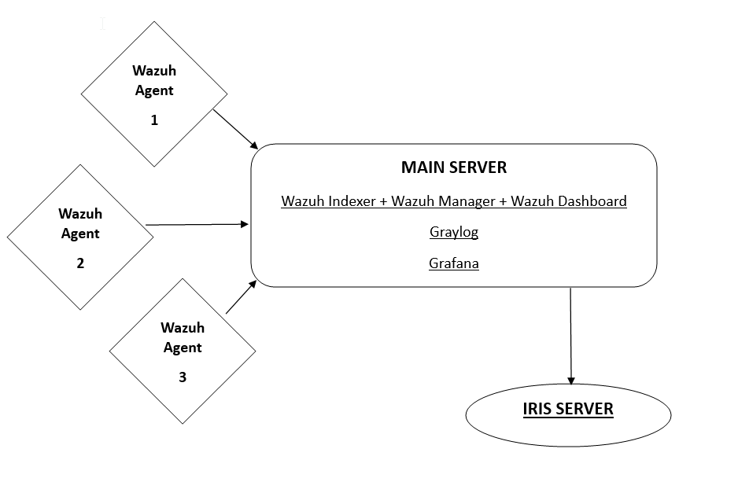
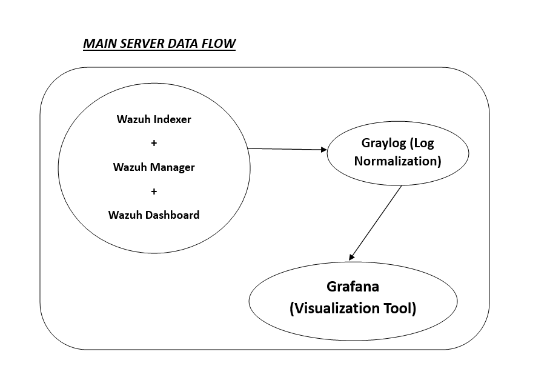

# Basic flow of the configuration

## **Architecture**

# Configuration Steps 
###  1.  Create the "Wazuh Server"(Distributed System using cluster method for load balancing)
###  2.  Create the "Graylog Server"
###  3.  Create the "Grafana Server"
###  4.  Create the "DFIR-IRIS Server"
###  5.  Install "Wazuh Agents"

#### - __*Very Important Note* :__ Here in this project I have managed to configure Wazuh Server , Graylog Server and Grafana Server on the same machine server to increase the efficiency of the hardware resources and CPU utilization else you can also build the separate servers for each !!!
---

# **_STEP-1_** : Wazuh Server
- Hardware requirements for the server
    - 2vCPU
    - 8 GB RAM 

- [Step by Step installation guide](./Wazuh/wazuh-server-configuration.md)

# **_STEP-2_** : Graylog Server
- Hardware requirements for the server
    - 2vCPU
    - 8 GB RAM 

- [Step by Step installation guide](./Graylog/graylog-configuration.md)

# **_STEP-3_** : Grafana Server
- [Step by Step installation guide](./Grafana/grafana-configuration.md)

# **_STEP-4_** : DFIR-IRIS Server
- Hardware requirements for the server
    - 2vCPU
    - 4 GB RAM 

- [Step by Step installation guide](./DFIR-IRIS/iris-server-configuration.md)

#### - __*Very Important Note* :__ Data flow in the "MAIN SERVER" is illustrated below which includes the first 4 steps.

---

---

# **_STEP-5_** : Wazuh Agents
- [Step by Step installation guide](./Wazuh/wazuh-agent-configuration.md)

---
---

# **_[Special Reference (Very Important !!!)](https://socfortress.medium.com/worlds-best-free-siem-stack-series-compilation-75f12abff21e)_**

---

